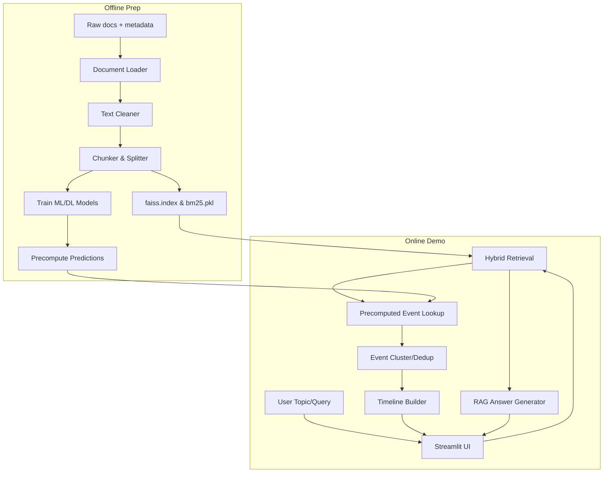

# ChronoRAG — ML-enhanced Timeline-Aware Research Assistant

ChronoRAG is an AI/NLP framework that builds chronological development timelines of academic and tech topics. It combines hybrid retrieval, machine/deep learning event sentence classification, date extraction, and semantic event clustering to structure historical highlights and power citation-backed RAG conversations.

---

## 1. Key Features
- **Offline Workflow**: Raw document ingestion, text cleaning, chunking, sentence splitting, event classification training (Logistic Regression/SVM and PyTorch BiLSTM), index building (FAISS + BM25), and precomputed predictions generation.
- **Online Workflow**: Fast topic-filtered hybrid retrieval, cached offline event lookup, time-constrained semantic clustering/deduplication, timeline synthesis, and a fallback-enabled RAG chat engine.
- **Streamlit Demo Dashboard**: Allows users to input topics, inspect sentence-level ML prediction probabilities, view clustered timelines with interactive cards, chat with document-cited answers, and view quantitative validation metrics.

---

## 2. Project Architecture



---

## 3. Folder Structure

```text
chrono-rag-assistant/
├── app/
│   └── streamlit_app.py          # Streamlit user interface
├── configs/
│   ├── config.yaml               # Paths, thresholds & hyperparameters
│   └── pipeline.yaml             # Pipeline step flow details
├── scripts/
│   ├── 01_ingest_documents.py    # Raw doc ingestion script
│   ├── 02_preprocess_documents.py# Document cleaning & splitting script
│   ├── 03_export_labeling_data.py# Sentence CSV exporter for annotations
│   ├── 04_train_ml_classifier.py # ML classifier baseline training script
│   ├── 05_train_dl_classifier.py # DL classifier training script (optional)
│   ├── 06_build_vector_index.py  # Vector and BM25 index constructor
│   ├── 07_precompute_predictions.py# Predict events and dates offline
│   ├── 08_build_timeline.py      # Timeline clustering script
│   └── 09_evaluate_system.py     # End-to-end evaluation script
├── src/
│   ├── ingest/                   # Document parsing & loading
│   ├── preprocessing/            # Chunker and sentence splitters
│   ├── indexing/                 # FAISS & BM25 indices builder
│   ├── retrieval/                # Multi-retriever modules
│   ├── models/                   # Classifier training & architectures
│   ├── timeline/                 # Date extraction & clustering logic
│   ├── generation/               # LLM clients & template fallbacks
│   ├── evaluation/               # Metric computation
│   └── utils/                    # IO operations, configuration, and logging
├── data/
│   ├── raw/                      # Raw text sources
│   │   └── sample/               # Out-of-the-box text sources
│   ├── processed/                # Parsed JSONL files
│   ├── labeled/                  # Exported/annotated datasets
│   ├── vector_db/                # Index caches
│   └── eval/                     # Test questions and gold timelines
├── models/                       # Model checkpoints (.pkl and .pt)
├── requirements.txt              # Project package list
├── .env.example                  # Environmental keys
├── Makefile                      # Command shortcut directory
└── README.md                     # Main documentation
```

---

## 4. Setup & Installation

Ensure you have Python 3.10+ installed.

1. **Clone the repository** and navigate to the repository root.
2. **Install dependencies**:
   ```bash
   pip install -r requirements.txt
   ```
3. **Configure the Environment**:
   Copy `.env.example` to `.env` and configure your API keys (optional; defaults to `mock` provider):
   ```bash
   cp .env.example .env
   ```

---

## 5. Quickstart

To run the offline ingestion pipeline and start the dashboard mock:

1. **Run Ingestion & Preprocessing**:
   ```bash
   python workflows/offline_pipeline.py
   ```
   This will process the sample files and create `documents.jsonl`, `chunks.jsonl`, and `sentences.jsonl` in `data/processed/`.

2. **Launch Streamlit Dashboard**:
   ```bash
   streamlit run app/streamlit_app.py
   ```

3. **Run Sprint 0 tests**:
   ```bash
   python -m unittest tests/test_sprint0.py
   ```

---

## 6. Pipeline Commands

Each script is a thin command-line wrapper around reusable code in `src/`.

```bash
python scripts/01_ingest_documents.py
python scripts/02_preprocess_documents.py
python scripts/03_export_labeling_data.py
python scripts/04_train_ml_classifier.py
python scripts/05_train_dl_classifier.py
python scripts/06_build_vector_index.py
python scripts/07_precompute_predictions.py
python scripts/08_build_timeline.py
python scripts/09_evaluate_system.py
```

The full Sprint 0 offline flow is:

```bash
python workflows/offline_pipeline.py
```

Secrets must stay in `.env`. The committed `.env.example` intentionally contains blank API keys and `LLM_PROVIDER=mock`.

---

## 7. MVP Roadmap

- **Sprint 0: Skeleton Setup** (Current) - Establish repository structure, configurations, sample files, and mock interfaces.
- **Sprint 1: Data Ingestion & Preprocessing** - Implement robust PDF/TXT/MD text parsing and semantic chunk splitters.
- **Sprint 2: Annotation Export** - Create annotation guideline and CSV exports.
- **Sprint 3: ML Classifier Baseline** - Implement TF-IDF + Logistic Regression/SVM with proper train/val/test stratification.
- **Sprint 4: DL Model Classifier** - PyTorch BiLSTM sentence classifier implementation.
- **Sprint 5: Indexing & Retrieval** - Build rank-bm25 and FAISS indices and a hybrid query resolver.
- **Sprint 6: Timeline Synthesis Engine** - Build date extraction, cosine similarity clustering, and sorting mechanisms.
- **Sprint 7: RAG Chatbot** - Complete LLM-supported query response pipeline with citation links and template fallback.
- **Sprint 8: Streamlit UI Polish** - Interface tabs styling and timeline visualization polish.
- **Sprint 9: Evaluation & Report** - Summary metrics calculation, confusion matrix plots, and final project writeup.
