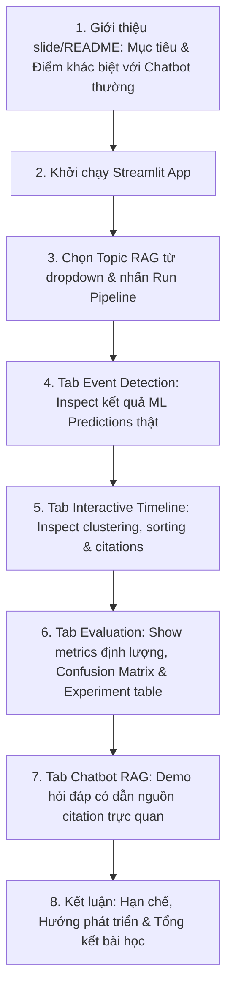

# ChronoRAG

**ML-enhanced Timeline-Aware Research Assistant** cho các chủ đề AI / ML / NLP.

ChronoRAG là project AI/NLP xây dựng **research assistant có nhận thức theo dòng thời gian**. Project không chỉ là chatbot đọc PDF — nó kết hợp nhiều kỹ thuật NLP/ML thành một hệ thống end-to-end:

- **Thu thập & xử lý tài liệu** — parse PDF, Markdown, HTML, TXT thành corpus chuẩn.
- **Truy xuất thông tin (Retrieval)** — keyword-based retrieval, BM25, FAISS vector search.
- **Phát hiện câu sự kiện (Event Detection)** — ML classifier (TF-IDF + LogReg/SVM) cho binary event vs non-event.
- **Phân loại loại sự kiện (Event Type Classification)** — multiclass: `method_proposed`, `release`, `benchmark`, `trend_application`, `none`.
- **Trích xuất mốc thời gian (Date Extraction)** — regex + document year fallback.
- **Gom cụm & khử trùng lặp (Event Clustering)** — sentence embedding + cosine similarity.
- **Xây dựng timeline** — sorted events với source citations.
- **Hỏi đáp RAG (Chatbot)** — retrieve context → generate answer với citations.

---

## Mục lục

1. [Trạng thái hiện tại](#trạng-thái-hiện-tại)
2. [Kiến trúc tổng thể](#kiến-trúc-tổng-thể)
3. [Cấu trúc repo](#cấu-trúc-repo)
4. [Mô tả chi tiết modules](#mô-tả-chi-tiết-modules)
5. [Data Schema](#data-schema)
6. [Cấu hình (Configs)](#cấu-hình-configs)
7. [Cài đặt local](#cài-đặt-local)
8. [Các lệnh thường dùng](#các-lệnh-thường-dùng)
9. [Makefile targets](#makefile-targets)
10. [Streamlit UI](#streamlit-ui)
11. [Pipeline hoạt động](#pipeline-hoạt-động)
12. [Labeling workflow](#labeling-workflow)
13. [Testing](#testing)
14. [Train trên Kaggle](#train-trên-kaggle)
15. [Thuật toán ML/DL và giải thích](#thuật-toán-mldl-và-giải-thích)
16. [Kịch bản Demo và Demo Flow](#kịch-bản-demo-và-demo-flow)
17. [Báo cáo (Report Outline)](#báo-cáo-report-outline)
18. [Những câu hỏi bảo vệ thường gặp (Q&A)](#những-câu-hỏi-bảo-vệ-thường-gặp-qa)
19. [Danh sách rủi ro (Risk List)](#danh-sách-rủi-ro-risk-list)
20. [Phụ lục A: Config groups](#phụ-lục-a-config-groups)
21. [Phụ lục B: Citation chain](#phụ-lục-b-citation-chain)
22. [Tài liệu tham khảo](#tài-liệu-tham-khảo)

---

## Trạng thái hiện tại

Hệ thống ChronoRAG đã được xây dựng hoàn thiện và tích hợp đầy đủ các tính năng của một trợ lý nghiên cứu tự động nhận thức thời gian.

### Các phần đã hoàn thành

| Hạng mục | Trạng thái |
| --- | --- |
| Khung repo ban đầu | ✅ Đã xong |
| Streamlit mock UI (4 tabs) | ✅ Đã xong |
| Chatbot local dạng keyword/template | ✅ Đã xong |
| Thu thập corpus cho MVP 3 topic | ✅ Đã xong |
| Parse PDF/MD/HTML/TXT | ✅ Đã xong |
| Làm sạch text, chunking, sentence splitting | ✅ Đã xong |
| Validate dữ liệu processed | ✅ Đã xong |
| Export dữ liệu để labeling | ✅ Đã xong |
| Pilot labeling 50 dòng | ✅ Đã xong |
| Full labeled dataset 1800 dòng | ✅ Đã xong |
| Phân chia train/val/test theo doc_id | ✅ Đã xong |
| Train ML baseline (TF-IDF + LogReg/SVM) | ✅ Đã xong |
| Pre-compute predictions (predictions.jsonl) | ✅ Đã xong |
| Build FAISS vector index | ✅ Đã xong |
| Build BM25 sparse index | ✅ Đã xong |
| Date extraction (regex + fallback) | ✅ Đã xong |
| Event clustering & deduplication | ✅ Đã xong |
| Timeline builder (per-topic + combined) | ✅ Đã xong |
| Confusion matrix plot | ✅ Đã xong |
| Evaluation metrics JSON | ✅ Đã xong |

### Số liệu đã kiểm chứng

| Artifact | Giá trị |
| --- | --- |
| Topic MVP | `rag`, `ai_agent`, `knowledge_distillation` |
| Số tài liệu corpus | 30 documents |
| Số chunks | ~590 (trong chunks.jsonl) |
| Số sentences | 986 (trong sentences.jsonl) |
| Số dòng labeled | 1,800 |
| Event sentences (labeled) | 298 |
| Non-event sentences (labeled) | 1,502 |
| Validation labeled data | 0 errors |
| Events detected (predictions) | 50 / 986 sentences (5.07%) |
| Events with extracted date | 50 / 50 (100%) |
| Unit tests | 7 test files |

### Metrics đánh giá mô hình (Test Set)

| Metric | Event Detector (Binary) | Event Type Classifier (Multiclass) |
| --- | --- | --- |
| Accuracy | 87.89% | 90.00% |
| Precision | 29.17% | 40.03% (macro) |
| Recall | 19.44% | 30.71% (macro) |
| F1-score | 23.33% | 33.33% (macro-F1) |

### Phân phối nhãn cuối

| Label | Số lượng |
| --- | ---: |
| `none` | 1502 |
| `trend_application` | 132 |
| `method_proposed` | 96 |
| `benchmark` | 57 |
| `release` | 13 |

### Repo hiện làm được gì?

- Chạy pipeline offline end-to-end: parse → clean → chunk → split → train → predict → build timeline.
- Tạo `documents.jsonl`, `chunks.jsonl`, `sentences.jsonl`, `predictions.jsonl`.
- Train ML baseline (TF-IDF + LogReg vs Calibrated SVM), lưu model checkpoint `.pkl`.
- Pre-compute event predictions cho toàn bộ sentences.
- Trích xuất mốc thời gian (date extraction) bằng regex + document year fallback.
- Gom cụm sự kiện trùng lặp bằng sentence embedding + cosine similarity.
- Xây dựng timeline tự động (per-topic + combined JSON).
- Build FAISS vector index và BM25 sparse index từ chunks.
- Validate dữ liệu processed (schema, referential integrity, noise detection).
- Validate dữ liệu labeled (prelabel mode / labeled mode).
- Export labeling candidates (1800 rows) và pilot sample (50 rows).
- Chạy Streamlit app với 4 tabs: Timeline, Event Detection, RAG Chatbot, Evaluation.
- RAG Chatbot hoạt động bằng keyword retrieval + template answerer khi có processed data.
- Sinh confusion matrix plot (`reports/figures/confusion_matrix.png`).
- Sinh metrics JSON (`data/eval/metrics.json`).

---

## Kiến trúc tổng thể

### High-level architecture

```
User chọn topic/question
        │
        ▼
   Streamlit UI (4 tabs)
        │
   ┌────┴────┐
   │         │
   ▼         ▼
Hybrid     RAG Answer
Retrieval  Generator
   │         │
   ├── BM25  │
   ├── Vector│
   │         │
   ▼         ▼
Retrieved  Answer +
Chunks     Citations
   │
   ▼
Lookup Pre-computed Predictions
   │
   ▼
Event Clustering / Dedup
   │
   ▼
Timeline Builder
```

### Offline vs Online separation

| Lớp | Chạy khi nào | Mục tiêu |
|---|---|---|
| **Offline preparation** | Trước demo, khi update data/model/index | Parse data, preprocess, label, train model, pre-compute predictions, build vector DB, build timeline |
| **Online demo** | Khi user mở Streamlit | Topic retrieval, lookup pre-computed events, cluster + timeline, RAG Q&A |

### Layer architecture

| Layer | Folder | Quy tắc |
|---|---|---|
| UI/frontend demo | `app/` | Chỉ hiển thị UI và gọi service functions từ `src/`. Không import sklearn, torch, faiss |
| Pipeline orchestration | `workflows/` | Gom nhiều bước offline thành flow hoàn chỉnh |
| CLI execution | `scripts/` | Chạy từng bước độc lập bằng command line |
| Backend/core logic | `src/` | Chứa logic thật. Tất cả ML/RAG/NLP code ở đây |

### Nguyên tắc thiết kế

1. Tất cả dữ liệu trung gian lưu dạng JSONL/CSV để dễ inspect.
2. Model và index build bằng script riêng, không build trực tiếp trong Streamlit.
3. Mọi output quan trọng có `doc_id`, `chunk_id`, `sentence_id` để trace citation.
4. Không hard-code API key; dùng `.env` và `.env.example`.
5. **Bắt buộc có fallback không cần LLM API**: template answer dựa trên retrieved context.
6. MVP ưu tiên chạy ổn, giải thích được, có metrics hơn là mô hình quá lớn.
7. **TF-IDF chỉ fit trên train set**, transform trên val/test — tránh data leakage.

---

## Cấu trúc repo

```text
chrono-rag-assistant/
├── app/
│   └── streamlit_app.py              # Streamlit UI (4 tabs), gọi service từ workflows/
│
├── workflows/
│   ├── offline_pipeline.py           # Pipeline offline: ingest → clean → chunk → sentences
│   └── online_pipeline.py            # Service functions cho Streamlit: mock data, local QA
│
├── configs/
│   ├── config.yaml                   # Paths, hyperparams, thresholds chính
│   ├── labeling_config.yaml          # Config sampling/scoring cho labeling export
│   └── pipeline.yaml                 # Định nghĩa thứ tự bước pipeline
│
├── scripts/
│   ├── 01_ingest_documents.py        # Ingest raw files → documents.jsonl
│   ├── 02_preprocess_documents.py    # Clean, chunk, sentence split
│   ├── 03_export_labeling_data.py    # Export labeling candidates CSV
│   ├── 04_train_ml_classifier.py     # Train TF-IDF + LogReg/SVM, evaluate, plot confusion matrix
│   ├── 05_train_dl_classifier.py     # [Placeholder] Train BiLSTM PyTorch
│   ├── 06_build_vector_index.py      # Build FAISS + BM25 index từ chunks.jsonl
│   ├── 07_precompute_predictions.py  # Pre-compute event predictions + date extraction
│   ├── 08_build_timeline.py          # Build timeline từ predictions (per-topic + combined)
│   ├── 09_evaluate_system.py         # [Placeholder] Evaluate toàn hệ thống
│   ├── 10_validate_processed_outputs.py  # Validate schema/quality processed data
│   └── 11_validate_labeled_data.py       # Validate labeled dataset (prelabel/labeled mode)
│
├── src/
│   ├── __init__.py
│   ├── ingest/                       # Document loading & parsing
│   │   ├── document_loader.py        # Load documents từ metadata.csv + raw files
│   │   └── document_parser.py        # Parse TXT, MD, HTML, PDF (PyMuPDF)
│   ├── preprocessing/                # Text processing pipeline
│   │   ├── cleaner.py                # Source-type-aware text cleaning (paper/general)
│   │   ├── chunker.py                # Sliding window character-based chunking
│   │   ├── sentence_splitter.py      # Regex/NLTK sentence splitting
│   │   ├── labeling_exporter.py      # Stratified sampling & export labeling dataset
│   │   └── label_validation.py       # Validate labeled CSV (schema, semantics, stats)
│   ├── indexing/                     # Vector DB & BM25 index building
│   │   ├── build_vector_index.py     # Build FAISS IndexFlatIP từ SentenceTransformer embeddings
│   │   └── build_bm25.py            # Build BM25Okapi index từ tokenized chunks
│   ├── retrieval/                    # Information retrieval
│   │   └── simple_retriever.py       # Keyword-based chunk retriever (MVP)
│   ├── models/                       # ML model training & prediction
│   │   ├── train_event_baseline.py   # Split dataset, train binary + multiclass classifiers
│   │   └── predict_events.py         # Load models, batch/single sentence prediction
│   ├── timeline/                     # Date extraction, clustering, timeline
│   │   ├── date_extractor.py         # Regex-based date extraction (full date, month-year, contextual, plain year, fallback)
│   │   ├── deduplicate.py            # Greedy threshold-based event clustering + deduplication
│   │   └── timeline_builder.py       # Build sorted timeline JSON per-topic + combined
│   ├── generation/                   # Answer generation
│   │   └── template_answerer.py      # Template-based answer từ retrieved chunks
│   ├── evaluation/                   # [Stub] Classifier, retrieval, timeline metrics
│   └── utils/                        # Shared utilities
│       ├── config.py                 # Load config.yaml, .env, project root
│       ├── io.py                     # Read/write JSONL, CSV, text files
│       ├── logger.py                 # Centralized logging setup
│       └── schema_validation.py      # Validate processed documents/chunks/sentences
│
├── data/
│   ├── raw/                          # Raw documents + metadata.csv (PDF gitignored)
│   │   ├── metadata.csv              # Document registry (doc_id, title, topic, ...) — 30 docs
│   │   ├── candidate_sources_p0.csv  # Nguồn ứng viên Phase 0
│   │   ├── rag/                      # Raw files topic RAG
│   │   ├── ai_agent/                 # Raw files topic AI Agent
│   │   ├── knowledge_distillation/   # Raw files topic Knowledge Distillation
│   │   ├── graphrag/                 # [Reserved] Raw files topic GraphRAG
│   │   ├── transformer/              # [Reserved] Raw files topic Transformer
│   │   └── sample/                   # Sample files cho reviewer test nhanh
│   ├── processed/                    # Processed pipeline outputs
│   │   ├── documents.jsonl           # Parsed documents
│   │   ├── chunks.jsonl              # Chunked text
│   │   ├── sentences.jsonl           # Split sentences (986 rows)
│   │   ├── predictions.jsonl         # Pre-computed ML predictions + date extraction
│   │   ├── timeline.json             # Combined timeline (all topics)
│   │   ├── timeline_ai_agent.json    # Timeline topic AI Agent
│   │   └── timeline_knowledge_distillation.json  # Timeline topic Knowledge Distillation
│   ├── labeled/                      # Labeled dataset cho training
│   │   ├── labeled_sentences.csv     # ★ Dataset nhãn cuối (1800 rows)
│   │   ├── labeling_candidates.csv   # Candidates ban đầu để gán nhãn
│   │   ├── labeling_candidates_sample.csv  # 50 câu pilot
│   │   ├── draft_label_suggestions.csv     # Gợi ý nhãn nháp bằng rule
│   │   ├── review_queue.csv          # Các dòng cần review kỹ
│   │   ├── labeling_export_report.json     # Report sampling statistics
│   │   ├── splits/                   # Train/Val/Test splits theo doc_id
│   │   │   ├── train.csv
│   │   │   ├── val.csv
│   │   │   └── test.csv
│   │   └── README.md                 # Schema & workflow guide cho labeled data
│   ├── vector_db/                    # FAISS + BM25 index artifacts
│   │   ├── faiss.index               # FAISS IndexFlatIP (cosine similarity)
│   │   ├── chunk_metadata.jsonl      # Chunk metadata tương ứng với FAISS index
│   │   ├── bm25.pkl                  # BM25Okapi index
│   │   └── bm25_corpus.pkl           # Chunk IDs tương ứng BM25
│   └── eval/                         # Validation reports, evaluation metrics
│       ├── processed_validation_report.json
│       ├── metrics.json              # ★ Metrics thật từ test set (binary + multiclass)
│       └── precompute_summary.json   # Summary thống kê predictions
│
├── saved_models/                     # Trained model checkpoints
│   ├── event_detector.pkl            # Binary event detector (TF-IDF vectorizer + model)
│   └── type_classifier.pkl           # Multiclass event type classifier (TF-IDF vectorizer + model)
├── models/                           # [Empty] Placeholder cho model definitions
├── reports/                          # Reports, figures, confusion matrices
│   └── figures/
│       └── confusion_matrix.png      # Confusion matrix plot (Event Type Classifier)
├── notebooks/                        # Jupyter notebooks cho EDA, experiments
├── docs/
│   ├── CHRONORAG_PLAN.md             # Plan tổng thể (54KB, rất chi tiết)
│   └── LABELING_GUIDE.md             # Guideline gán nhãn event sentence
├── tests/                            # Unit & integration tests (7 test files)
│
├── requirements.txt                  # Python dependencies
├── Makefile                          # Shortcut commands
├── .env.example                      # Template biến môi trường
├── .gitignore                        # Ignore rules
└── README.md                         # ← Bạn đang đọc file này
```

> **Lưu ý:** Raw PDF được ignore bằng `.gitignore` qua rule `data/raw/**/*.pdf`. File PDF lớn nên chia sẻ qua Drive/Kaggle, không commit trực tiếp lên Git.

---

## Mô tả chi tiết modules

### `src/ingest/` — Document Ingestion

| File | Chức năng |
|---|---|
| `document_loader.py` | Đọc `metadata.csv`, load và parse từng file raw, tạo document dict với đầy đủ metadata |
| `document_parser.py` | Dispatch parser theo extension: `.txt`/`.md` → read text, `.html` → BeautifulSoup strip tags, `.pdf` → PyMuPDF page-by-page |

**Supported formats:** `.txt`, `.md`, `.html`, `.htm`, `.pdf`

**Error handling:** File không tìm thấy hoặc extension không hỗ trợ → log warning và skip, không dừng pipeline.

---

### `src/preprocessing/` — Text Processing

| File | Chức năng |
|---|---|
| `cleaner.py` | Source-type-aware text cleaning. Paper/survey: normalize LaTeX artifacts, mojibake, ligatures. General (docs/blog/github): strip HTML noise, badges, comments. Tất cả: normalize whitespace. **Bảo toàn date/year/version/citation signals.** |
| `chunker.py` | Sliding window character-based chunking. Default: 1000 chars, overlap 200 chars. Giữ metadata (`doc_id`, `topic`, `title`, `source_url`, `year`). |
| `sentence_splitter.py` | Split text thành sentences bằng regex (default) hoặc NLTK (opt-in qua `CHRONORAG_USE_NLTK=1`). Filter sentences ngắn hơn `min_sentence_len` (default 15 chars). |
| `labeling_exporter.py` | **Deterministic stratified sampling** cho labeling dataset. Score sentences dựa trên event verbs, entity names, date patterns. Allocate budget per-doc với round-robin. Phân bucket high/medium/low. Output: `labeling_candidates.csv` (1800 rows) + `labeling_candidates_sample.csv` (50 pilot rows). |
| `label_validation.py` | Validate labeled CSV: kiểm tra schema, duplicate `sentence_id`, referential integrity với `sentences.jsonl`, semantic compatibility (`is_event` ↔ `event_type`), doc dominance warning, topic distribution warning. Hỗ trợ 2 mode: `prelabel` (loose) và `labeled` (strict). |

---

### `src/indexing/` — Index Building

| File | Chức năng |
|---|---|
| `build_vector_index.py` | Build FAISS IndexFlatIP từ `chunks.jsonl`. Dùng SentenceTransformer (`all-MiniLM-L6-v2`) encode text → L2-normalize → inner product index. Lưu `faiss.index` + `chunk_metadata.jsonl`. |
| `build_bm25.py` | Build BM25Okapi index từ `chunks.jsonl`. Tokenize bằng lowercase whitespace split. Lưu `bm25.pkl` + `bm25_corpus.pkl` (chunk IDs). |

---

### `src/retrieval/` — Information Retrieval

| File | Chức năng |
|---|---|
| `simple_retriever.py` | MVP keyword-based retriever. Load `chunks.jsonl`, scoring dựa trên TF match (text ×1, title ×5, topic ×2), natural sentence match bonus (×10), definition pattern boost (×50), code penalty. Hỗ trợ topic filtering. |

---

### `src/models/` — ML Model Training & Prediction

| File | Chức năng |
|---|---|
| `train_event_baseline.py` | **Split dataset** theo `doc_id` có stratify by topic. **Train binary classifier** (Event/Non-event): so sánh LogReg vs Calibrated LinearSVC, chọn model F1 cao hơn trên val set. **Train multiclass classifier** (5 event types): Calibrated LinearSVC. TF-IDF unigram+bigram, max 5000 features. |
| `predict_events.py` | Load trained models (`.pkl`), dự đoán batch hoặc single sentence. Output: `is_event`, `event_prob`, `event_type`, `type_confidence`. Nếu `is_event=0` → force `event_type='none'`. |

---

### `src/timeline/` — Timeline Construction

| File | Chức năng |
|---|---|
| `date_extractor.py` | Regex-based date extraction theo priority: (1) full date `YYYY-MM-DD` → confidence 1.0, (2) Month Year → 0.9, (3) contextual year `in/since/after YYYY` → 0.85, (4) plain year `YYYY` → 0.7, (5) document year fallback → 0.4, (6) no date → 0.0. |
| `deduplicate.py` | Greedy threshold-based clustering. Encode sentences bằng SentenceTransformer, tính cosine similarity matrix. Gom cụm nếu similarity ≥ 0.78 và year diff ≤ 1. Chọn representative theo event_prob + date_confidence cao nhất. Gom `cluster_sources` từ nhiều documents. |
| `timeline_builder.py` | Sort events theo year ascending + event_prob descending. Format thành timeline schema với `event_id`, `date`, `event_type`, `title`, `sources`, `cluster_size`. Hỗ trợ `build_all_timelines()` cho tất cả topics + combined. |

---

### `src/generation/` — Answer Generation

| File | Chức năng |
|---|---|
| `template_answerer.py` | Template-based answer generator (fallback khi không có LLM API). Extract sentences từ retrieved chunks, match với query tokens, select top sentences, format answer với `[doc_id]` citations. |

---

### `src/evaluation/` — [Stub] Evaluation Metrics

Hiện tại chỉ có `__init__.py`. Logic đánh giá classifier đang nằm trực tiếp trong `scripts/04_train_ml_classifier.py`.

---

### `src/utils/` — Shared Utilities

| File | Chức năng |
|---|---|
| `config.py` | Load `configs/config.yaml` (PyYAML hoặc built-in fallback parser), resolve relative paths, load `.env` file, export `PROJECT_ROOT`, `load_config()`, `get_env_var()` |
| `io.py` | Read/write helpers: `read_jsonl()`, `write_jsonl()`, `read_csv()`, `write_csv()`, `read_text()`, `write_text()`. Tất cả auto-create parent directories. |
| `logger.py` | Centralized logging setup |
| `schema_validation.py` | Validate processed data quality: check required fields, unique IDs, referential integrity (chunks → docs, sentences → chunks), text quality, noise markers (HTML tags, mojibake, shields.io), per-document status report. |

---

### `workflows/` — Pipeline Orchestration

| File | Chức năng |
|---|---|
| `offline_pipeline.py` | End-to-end offline pipeline: load config → ingest documents → clean text → chunk documents → split sentences → export JSONL files. |
| `online_pipeline.py` | Service functions cho Streamlit: mock timeline events (3 topics), mock sentence predictions, mock Q&A answers, mock evaluation metrics, **real local QA** (`get_local_qa_answer()` — retrieve + template answer nếu processed data tồn tại). |

---

### `app/` — Streamlit UI

`streamlit_app.py` — Premium dark-theme UI với glassmorphism design, 4 tabs:

| Tab | Nội dung |
|---|---|
| 📅 Interactive Timeline | Vertical timeline với event badges (color-coded by type), confidence scores, source citations |
| 🔍 Event Detection (ML) | Sentence-level classification display: event probability, predicted type |
| 💬 RAG Chatbot | Chat interface với local QA retrieval, source citations |
| 📈 Evaluation Dashboard | Metric cards (F1, Recall@5, etc.), confusion matrix, ML vs DL comparison table |

**UI Features:**
- Custom Google Fonts (Outfit + Inter)
- Glassmorphism cards với hover animations
- Color-coded event type badges
- Sidebar: topic selector, retrieval top-K slider, classifier mode radio
- LLM provider status warning

---

## Data Schema

### `metadata.csv` (Document Registry)

| Column | Type | Required | Mô tả |
|---|---|:---:|---|
| `doc_id` | string | ✅ | ID duy nhất, vd `rag_001` |
| `title` | string | ✅ | Tên paper/doc/blog |
| `topic` | string | ✅ | `rag`, `ai_agent`, `knowledge_distillation` |
| `source_type` | string | ✅ | `paper`, `survey`, `docs`, `github`, `blog`, `wiki` |
| `source_url` | string | ✅ | URL gốc |
| `published_date` | string | | `YYYY-MM-DD` nếu biết |
| `year` | int | | Năm công bố |
| `authors` | string | | Danh sách tác giả (phân cách bằng `;`) |
| `local_path` | string | ✅ | File path tương đối trong `data/raw/` |
| `retrieved_at` | string | ✅ | Ngày nhóm tải tài liệu |

### `documents.jsonl`

```json
{
  "doc_id": "rag_001",
  "title": "Retrieval-Augmented Generation for Knowledge-Intensive NLP Tasks",
  "topic": "rag",
  "source_type": "paper",
  "source_url": "https://arxiv.org/abs/2005.11401",
  "published_date": "2020-05-22",
  "year": 2020,
  "authors": ["Patrick Lewis"],
  "local_path": "rag/rag_001.pdf",
  "text": "full cleaned text ...",
  "retrieved_at": "2026-05-20"
}
```

### `chunks.jsonl`

```json
{
  "chunk_id": "rag_001_c0005",
  "doc_id": "rag_001",
  "topic": "rag",
  "title": "Retrieval-Augmented Generation for...",
  "chunk_index": 5,
  "text": "chunk text ...",
  "start_char": 3200,
  "end_char": 4100,
  "source_url": "https://...",
  "year": 2020
}
```

### `sentences.jsonl`

```json
{
  "sentence_id": "rag_001_s0032",
  "doc_id": "rag_001",
  "chunk_id": "rag_001_c0005",
  "topic": "rag",
  "sentence_index": 32,
  "text": "RAG was introduced in 2020 as a retrieval-augmented generation framework.",
  "source_url": "https://...",
  "year": 2020
}
```

### `predictions.jsonl` (Pre-computed ML Predictions)

```json
{
  "sentence_id": "rag_001_s0032",
  "doc_id": "rag_001",
  "chunk_id": "rag_001_c0005",
  "topic": "rag",
  "text": "RAG was introduced in 2020 as a retrieval-augmented generation framework.",
  "is_event": 1,
  "event_prob": 0.9234,
  "event_type": "method_proposed",
  "type_confidence": 0.8712,
  "date_text": "2020",
  "normalized_date": "2020",
  "extracted_year": 2020,
  "date_confidence": 0.7,
  "date_source": "sentence_regex",
  "source_url": "https://...",
  "source_year": 2020
}
```

### `labeled_sentences.csv` (Labeled Dataset)

| Cột | Ý nghĩa |
| --- | --- |
| `sentence_id` | Globally unique identifier (vd: `agent_001_s42`) |
| `doc_id` | Document ID từ metadata.csv |
| `chunk_id` | Chunk ID từ chunk processing |
| `topic` | `rag`, `ai_agent`, `knowledge_distillation` |
| `title` | Document title |
| `source_url` | URL nguồn |
| `year` | Năm công bố document |
| `sentence` | Text snippet cần đánh giá |
| `is_event` | `1` nếu câu là event sentence, `0` nếu không |
| `event_type` | `method_proposed`, `release`, `benchmark`, `trend_application`, hoặc `none` |
| `annotator` | Người review/gán nhãn |
| `label_method` | `human` với nhãn đã được người review |
| `notes` | Ghi chú cho case mơ hồ nếu cần |

### Event Type Taxonomy (5 classes)

| Label | Định nghĩa | Ví dụ |
|---|---|---|
| `method_proposed` | Phương pháp, kiến trúc, thuật toán mới được đề xuất | "In 2020, Lewis et al. proposed RAG..." |
| `release` | Model/tool/framework được phát hành công khai | "LangChain was released in October 2022." |
| `benchmark` | Kết quả benchmark, SOTA, performance so sánh | "Our model achieves 85.3% on MMLU..." |
| `trend_application` | Xu hướng, ứng dụng existing method vào domain mới | "RAG has become a dominant trend..." |
| `none` | Không phải event sentence | "RAG combines retrieval and generation." |

---

## Cấu hình (Configs)

### `configs/config.yaml` — Cấu hình chính

```yaml
paths:
  raw_data_dir: "data/raw"
  sample_data_dir: "data/raw/sample"
  processed_data_dir: "data/processed"
  labeled_data_dir: "data/labeled"
  vector_db_dir: "data/vector_db"
  saved_models_dir: "saved_models"
  eval_dir: "data/eval"
  demo_outputs_dir: "data/demo_outputs"

preprocessing:
  chunk_size: 1000          # characters
  chunk_overlap: 200        # characters
  min_sentence_len: 15      # characters

indexing:
  embedding_model: "all-MiniLM-L6-v2"
  faiss_index_path: "data/vector_db/faiss.index"
  bm25_index_path: "data/vector_db/bm25.pkl"

retrieval:
  top_k: 5
  hybrid_alpha: 0.5

models:
  random_seed: 42
  event_threshold: 0.5
  test_size: 0.15
  val_size: 0.15

timeline:
  similarity_threshold: 0.78
  year_diff_threshold: 1
```

### `configs/labeling_config.yaml` — Cấu hình labeling

Quản lý chiến lược sampling cho labeling export:
- **Sampling targets:** 1800 total, 600 per topic, 100 per-doc cap
- **Score buckets:** high (40%), medium (30%), low (30%)
- **Event verbs:** propose, introduce, release, publish, announce, launch, outperform, evaluate, benchmark, deploy, ...
- **Entity names:** BERT, GPT, LLM, Transformer, AutoGPT, LangChain, LlamaIndex, ...
- **Date patterns:** year patterns (`\b(19|20)\d{2}\b`), month-year patterns

### `configs/pipeline.yaml` — Thứ tự pipeline

Định nghĩa 9 bước pipeline offline: ingest → preprocess → export_labeling → train_ml → train_dl → build_index → precompute → build_timeline → evaluate.

### `.env.example` — Biến môi trường

```bash
LLM_PROVIDER=mock          # Options: mock, openai, gemini, openrouter
OPENAI_API_KEY=
GEMINI_API_KEY=
OPENROUTER_API_KEY=
```

---

## Cài đặt local

**Yêu cầu:** Python 3.10+

```powershell
# 1. Clone repo
git clone <repo-url>
cd chrono-rag-assistant

# 2. Tạo virtual environment
python -m venv .venv
.\.venv\Scripts\Activate.ps1

# 3. Cài dependencies
python -m pip install --upgrade pip
pip install -r requirements.txt

# 4. Cấu hình environment (optional, cho LLM API)
Copy-Item .env.example .env
# Sửa .env nếu muốn dùng OpenAI/Gemini/OpenRouter
```

### Dependencies chính

| Package | Vai trò |
|---|---|
| `streamlit` | Web UI framework |
| `pandas`, `numpy` | Data manipulation |
| `nltk` | Sentence tokenization (optional) |
| `scikit-learn` | ML classifiers (TF-IDF, SVM, LogReg) |
| `torch` | Deep Learning (BiLSTM) |
| `sentence-transformers` | Sentence embeddings (FAISS indexing, event clustering) |
| `faiss-cpu` | Vector similarity search |
| `rank-bm25` | BM25 retrieval |
| `pymupdf` | PDF parsing |
| `beautifulsoup4`, `lxml` | HTML parsing |
| `matplotlib`, `plotly` | Visualization |
| `pyyaml` | Config file parsing |
| `python-dotenv` | Environment variable loading |
| `pytest` | Testing framework |
| `requests` | HTTP requests |

> **Không commit** `.env` hoặc API key.

---

## Các lệnh thường dùng

### Chạy pipeline offline (end-to-end)

```powershell
python workflows/offline_pipeline.py
```

Pipeline sẽ: ingest documents → clean text → chunk → split sentences → export JSONL.

### Chạy từng bước riêng

```powershell
# Ingest documents
python scripts/01_ingest_documents.py

# Preprocess (clean, chunk, split)
python scripts/02_preprocess_documents.py

# Export labeling candidates
python scripts/03_export_labeling_data.py

# Train ML classifiers (binary + multiclass)
python scripts/04_train_ml_classifier.py

# Build FAISS + BM25 indices
python scripts/06_build_vector_index.py

# Pre-compute event predictions + date extraction
python scripts/07_precompute_predictions.py

# Build timeline from predictions
python scripts/08_build_timeline.py
```

### Validate dữ liệu

```powershell
# Validate processed outputs (documents, chunks, sentences)
python scripts/10_validate_processed_outputs.py

# Validate labeled dataset (prelabel mode — loose)
python scripts/11_validate_labeled_data.py --input data/labeled/labeling_candidates.csv --mode prelabel

# Validate labeled dataset (labeled mode — strict)
python scripts/11_validate_labeled_data.py --input data/labeled/labeled_sentences.csv --mode labeled
```

### Chạy tests

```powershell
# Chạy tất cả tests bằng pytest
pytest tests/

# Hoặc chạy bằng unittest (chi tiết hơn)
python -m unittest discover tests/
```

### Chạy Streamlit app

```powershell
streamlit run app/streamlit_app.py
```

App mở tại `http://localhost:8501`.

---

## Makefile targets

Trên Linux/macOS (hoặc Windows với `make` installed):

| Target | Lệnh | Mô tả |
|---|---|---|
| `make install` | `pip install -r requirements.txt` | Cài dependencies |
| `make ingest` | `python scripts/01_ingest_documents.py` | Ingest raw documents |
| `make preprocess` | `python scripts/02_preprocess_documents.py` | Preprocess text |
| `make label-export` | `python scripts/03_export_labeling_data.py` | Export labeling data |
| `make train-ml` | `python scripts/04_train_ml_classifier.py` | Train ML baseline |
| `make train-dl` | `python scripts/05_train_dl_classifier.py` | Train DL model |
| `make build-index` | `python scripts/06_build_vector_index.py` | Build FAISS + BM25 index |
| `make precompute` | `python scripts/07_precompute_predictions.py` | Pre-compute predictions |
| `make build-timeline` | `python scripts/08_build_timeline.py` | Build timeline |
| `make evaluate` | `python scripts/09_evaluate_system.py` | Evaluate system |
| `make offline-all` | Chạy ingest → preprocess → build-index → precompute → evaluate | Full offline pipeline |
| `make app` | `streamlit run app/streamlit_app.py` | Start Streamlit |
| `make test` | `pytest tests/` | Chạy tests |

---

## Streamlit UI

### Tab 1: 📅 Interactive Timeline

Hiển thị timeline dạng vertical với:
- Event badges color-coded: 🟣 `method_proposed`, 🟢 `release`, 🟡 `benchmark`, 🩷 `trend_application`
- Glassmorphism cards cho mỗi event
- Source citations với links
- Confidence score và cluster size

### Tab 2: 🔍 Event Detection (ML)

Hiển thị sentence-level classification:
- Mỗi sentence với event probability (%)
- Label EVENT / NON-EVENT
- Predicted event type

### Tab 3: 💬 RAG Chatbot

Chat interface tương tác:
- Nhập câu hỏi (vd: "When was RAG proposed?")
- Hệ thống retrieve relevant chunks → generate answer
- Hiển thị citations với doc_id, title, source URL
- **Hiện tại:** dùng local keyword retrieval + template answer nếu có processed data, fallback mock data nếu không có

### Tab 4: 📈 Evaluation Dashboard

Dashboard metrics:
- Event Detection F1, Event Type Macro-F1, Retrieval Recall@5, Timeline Date Accuracy
- Confusion matrix (Event Type Classification)
- ML vs DL experiment comparison table

> **Lưu ý:** Hiện tại tab Evaluation hiển thị mock metrics. Metrics thật đã có trong `data/eval/metrics.json` nhưng chưa được tích hợp vào UI.

### Sidebar Settings

- **Topic selector:** RAG / AI Agent / Knowledge Distillation
- **Retrieval Top-K:** slider (1-10)
- **Classifier mode:** TF-IDF + LogReg (Baseline) / BiLSTM (Deep Learning)
- **Environment info:** LLM provider status

---

## Pipeline hoạt động

### Offline Pipeline Flow

```
data/raw/metadata.csv + raw files (PDF/MD/HTML/TXT)
        │
        ▼  [01_ingest_documents.py]
   document_loader.py → document_parser.py
        │
        ▼  [02_preprocess_documents.py]
   cleaner.py → clean_text(text, source_type)
        │
        ▼
   chunker.py → chunk_document(doc, chunk_size=1000, overlap=200)
        │
        ▼
   sentence_splitter.py → split_chunks_into_sentences(chunks, min_len=15)
        │
        ▼
   data/processed/documents.jsonl
   data/processed/chunks.jsonl
   data/processed/sentences.jsonl
        │
        ▼  [03_export_labeling_data.py]
   labeling_exporter.py → Stratified sampling → 1800 candidates
        │
        ▼  [04_train_ml_classifier.py]
   train_event_baseline.py → Split by doc_id → Train binary + multiclass
        │
        ▼
   saved_models/event_detector.pkl
   saved_models/type_classifier.pkl
   data/eval/metrics.json
   reports/figures/confusion_matrix.png
        │
        ▼  [06_build_vector_index.py]
   build_vector_index.py → FAISS index
   build_bm25.py → BM25 index
        │
        ▼
   data/vector_db/faiss.index + chunk_metadata.jsonl
   data/vector_db/bm25.pkl + bm25_corpus.pkl
        │
        ▼  [07_precompute_predictions.py]
   predict_events.py + date_extractor.py → predictions.jsonl
        │
        ▼  [08_build_timeline.py]
   deduplicate.py + timeline_builder.py → timeline.json + per-topic JSONs
```

### Online (Streamlit) Flow

```
User chọn topic + nhập question
        │
        ▼
   online_pipeline.py → get_local_qa_answer(topic, question)
        │
        ├── SimpleRetriever → load chunks.jsonl → keyword scoring → top-3 chunks
        │
        └── TemplateAnswerer → extract sentences → match query → format answer + citations
        │
        ▼
   Hiển thị answer + citations trong chat UI
```

Nếu `chunks.jsonl` không tồn tại → fallback sang mock data.

---

## Labeling workflow

### Quy trình gán nhãn

1. **Chuẩn bị:** Đọc [LABELING_GUIDE.md](docs/LABELING_GUIDE.md) để hiểu event types và ví dụ.
2. **Pilot:** Gán nhãn 50 câu pilot (`labeling_candidates_sample.csv`), chạy validation.
3. **Full labeling:** Gán nhãn toàn bộ 1800 câu trong `labeling_candidates.csv`.
4. **Validate:** Chạy `scripts/11_validate_labeled_data.py --mode labeled` → 0 errors.
5. **Output:** File cuối là `labeled_sentences.csv` dùng cho training.

### Tiêu chí gán event (`is_event = 1`)

Câu thỏa **ít nhất 2 trong 3** tiêu chí:
1. Có **hành động/thay đổi đáng kể**: introduced, proposed, released, achieved, launched...
2. Có **mốc thời gian** rõ hoặc suy được: năm, tháng, ngày, version, paper year.
3. Có **thực thể cụ thể**: model, method, paper, framework, benchmark.

### Split train/val/test

**Split theo `doc_id`, KHÔNG split random theo sentence** (tránh data leakage).

| Split | Tỷ lệ | Mục đích |
|---|---:|---|
| Train | 70% docs | Train model |
| Validation | 15% docs | Chọn hyperparameter |
| Test | 15% docs | Báo cáo kết quả cuối |

- Stratify by topic — mỗi topic có mặt trong cả train/val/test.
- Seed cố định: `random_seed: 42` (trong `config.yaml`).
- **TF-IDF chỉ fit trên train set**, transform trên val/test.

---

## Testing

### Test files

| Test file | Sprint | Nội dung |
|---|---|---|
| `test_sprint0.py` | 0 | Smoke tests: project structure, config loading, imports |
| `test_sprint15_local_qa.py` | 1.5 | Local QA: SimpleRetriever, TemplateAnswerer, query matching |
| `test_sprint2_ingestion.py` | 2 | Ingestion: document loading, PDF/HTML/TXT parsing |
| `test_sprint2_cleaning.py` | 2 | Cleaning: HTML noise, LaTeX, badges, whitespace, source-type-aware cleaning |
| `test_sprint2_validation.py` | 2 | Schema validation: documents/chunks/sentences integrity |
| `test_label_validation.py` | 3 | Label validation: schema, semantics, stats, edge cases |
| `test_sprint4_training.py` | 4 | Training pipeline: dataset split, binary/multiclass training, prediction inference |

### Chạy tests

```powershell
# Chạy tất cả
pytest tests/ -v

# Chạy một file cụ thể
pytest tests/test_sprint4_training.py -v

# Chạy bằng unittest
python -m unittest discover tests/
```

---

## Train trên Kaggle

Nên dùng Kaggle nếu máy local yếu hoặc RAM thấp.

### Các file tối thiểu cần upload

```text
data/labeled/labeled_sentences.csv
configs/
src/
scripts/
requirements.txt
```

### Lệnh train

```bash
# ML baseline (TF-IDF + LogReg/SVM)
pip install -r requirements.txt
python scripts/04_train_ml_classifier.py --input data/labeled/labeled_sentences.csv --output-dir saved_models --eval-dir data/eval

# DL baseline (BiLSTM PyTorch) — chưa implement
python scripts/05_train_dl_classifier.py --input data/labeled/labeled_sentences.csv --output-dir saved_models --eval-dir data/eval
```

### Sau khi train, tải output về repo

```text
saved_models/       # Model checkpoints (.pkl, .pt)
data/eval/          # Metrics JSON, classification report
reports/figures/    # Confusion matrix, plots
```

Chỉ commit code, config, metrics nhỏ. Model checkpoint quá lớn thì để Drive/Kaggle output.

---

## Thuật toán ML/DL và giải thích

Để phục vụ cho báo cáo và bảo vệ bài tập lớn, dưới đây là bảng thống kê các thuật toán, mô hình và độ đo được sử dụng trong hệ thống ChronoRAG:

| Thuật toán / Độ đo | Thành phần áp dụng | Mục đích sử dụng | Ý nghĩa & Cơ sở lý thuyết |
| :--- | :--- | :--- | :--- |
| **TF-IDF** | Event Classifier, Event Type Classifier | Trích xuất đặc trưng từ văn bản (feature extraction) | Biến đổi câu thành sparse vector dựa trên tần suất từ trong câu và nghịch đảo tần suất trong toàn bộ corpus. |
| **Logistic Regression** | Event Classifier (Baseline) | Phân loại nhị phân câu là Event hay Non-event | Sử dụng hàm Sigmoid để ánh xạ đầu ra thành xác suất trong khoảng `[0, 1]`, tối ưu hóa hàm mất mát Cross-Entropy. |
| **Linear SVM** | Event Type Classifier (Multiclass) | Phân loại câu sự kiện thành 5 nhóm nhãn | Tối ưu hóa lề (margin) để tìm siêu phẳng phân tách tốt nhất, đặc biệt hiệu quả và ít overfitting với đặc trưng sparse độ chiều cao. |
| **Word Embedding** | BiLSTM Classifier (Optional) | Biểu diễn từ dưới dạng dense vector liên tục | Chuyển đổi token thành các vector đặc trưng có phân phối ngữ nghĩa, có thể học trực tiếp hoặc dùng pre-trained (Word2Vec/GloVe). |
| **BiLSTM** | Deep Learning Event Classifier (Optional) | Học đặc trưng chuỗi văn bản có tính tới thứ tự từ | Mạng RNN hai chiều (forward & backward) giúp nắm bắt ngữ cảnh từ trái qua phải và từ phải qua trái của câu. |
| **Sentence Embedding** | Event Retrieval & Clustering | Mã hóa câu thành dense vector cố định (384D) | Sử dụng pre-trained model `all-MiniLM-L6-v2` của SentenceTransformers để giữ quan hệ ngữ nghĩa ngữ cảnh sâu. |
| **Cosine Similarity** | Retrieval & Deduplication | Đo lường độ tương đồng ngữ nghĩa giữa các vector | Tính góc giữa hai vector trong không gian đa chiều, không phụ thuộc vào độ dài văn bản (scale-invariant). |
| **BM25** | Keyword-based Retrieval | Tìm kiếm và xếp hạng tài liệu theo từ khóa | Thuật toán xếp hạng xác suất dựa trên tần suất từ (TF) có tính tới mức độ bão hòa (TF saturation) và độ dài văn bản (length normalization). |
| **KNN / ANN** | Vector DB Retrieval | Tìm kiếm các chunk gần nhất với truy vấn | Tìm kiếm K lân cận (K-Nearest Neighbors) hoặc Tìm kiếm lân cận xấp xỉ (Approximate Nearest Neighbor - FAISS) để tăng tốc độ truy xuất. |
| **Threshold Clustering** | Event Deduplication | Gom cụm và loại bỏ các sự kiện trùng lặp | Nhóm các câu sự kiện có Cosine Similarity $\ge$ `similarity_threshold` (0.78) và khoảng cách thời gian $\le$ `year_diff_threshold` (1 năm). |
| **Precision / Recall / F1** | Classifier Evaluation | Đánh giá chất lượng mô hình phân loại | Đo lường mức độ chính xác (Precision), độ bao phủ (Recall) và điểm F1 (F1-score) trung bình điều hòa, đặc biệt là Macro-F1 để đối phó với class imbalance. |
| **Recall@K / MRR** | Retrieval Evaluation | Đánh giá chất lượng bộ truy xuất thông tin | Recall@K đo tỉ lệ tài liệu liên quan được trả về trong top K kết quả; MRR (Mean Reciprocal Rank) đánh giá vị trí xuất hiện của tài liệu đúng đầu tiên. |

---

## Kịch bản Demo và Demo Flow

Hệ thống ChronoRAG được thiết kế tối ưu cho buổi live demo trước hội đồng. Trọng tâm của demo là **AI/ML core logic và khả năng phân tích dòng thời gian**, chatbot RAG chỉ đóng vai trò bổ trợ.

### 1. Kịch bản Demo 7-10 phút



1. **Giới thiệu tổng quan (1-2 phút):** Trình bày nhanh slide hoặc tài liệu README giới thiệu dự án ChronoRAG. Nhấn mạnh điểm cốt lõi: kết hợp ML Classifier để phát hiện event và Embedding Clustering để dựng timeline tự động.
2. **Event Detection Tab (2 phút) [BẮT ĐẦU TẠI ĐÂY]:**
   - Chọn topic `RAG` trên sidebar.
   - Show kết quả phân loại ở mức câu: Các câu màu xanh nhạt hoặc có nhãn là **EVENT** kèm theo xác suất phân loại (ví dụ: `0.92`).
   - Show các câu được gán nhãn loại sự kiện: `method_proposed`, `release`, `benchmark`...
   - *Mục tiêu:* Chứng minh hệ thống thực sự có ML/DL classifier chạy dưới nền, phân tích từng câu của tài liệu.
3. **Timeline Tab (2 phút):**
   - Chuyển sang tab Timeline để thấy dòng thời gian được dựng tự động từ các câu event trên.
   - Giải thích cơ chế lọc mốc thời gian (Regex) và thuật toán gom cụm khử trùng lặp (Threshold-based Clustering với ràng buộc năm phát hành).
   - Click xem chi tiết nguồn trích dẫn (Citations) của từng event card (Doc ID, Title, Source URL).
4. **Evaluation Tab (1.5 phút):**
   - Cho hội đồng xem các biểu đồ định lượng: confusion matrix, precision-recall curve của các model.
   - So sánh hiệu năng giữa ML Baseline (TF-IDF + LogReg/SVM) với DL/Transfer Learning.
5. **Chatbot RAG Tab (1 phút):**
   - Đặt câu hỏi thực tế: *"When was RAG proposed and what was its performance?"*
   - Chatbot trả về câu trả lời tổng hợp kèm liên kết citation dạng click được.
6. **Tổng kết & Q&A (1-2 phút):** Nêu các hạn chế và kết thúc buổi trình bày.

### 2. Các câu hỏi demo chuẩn bị sẵn

| Chủ đề | Câu hỏi truy vấn / RAG chatbot | Kết quả mong đợi |
| :--- | :--- | :--- |
| **RAG** | *"What were the major milestones in RAG research?"* | Trả lời về năm 2020 (RAG paper), 2022 (LangChain), 2024 (GraphRAG/Corrective RAG) kèm các liên kết tài liệu nguồn. |
| **AI Agent** | *"What frameworks contributed to AI agent development?"* | Liệt kê AutoGPT, BabyAGI (2023) và CrewAI/AutoGen (2023/2024). |
| **Knowledge Distillation** | *"How did distillation apply to large language models?"* | Trình bày các mốc từ DistilBERT (2019) đến các phương pháp distillation cho LLM gần đây. |

### 3. Phương án dự phòng (Backup Plans) khi có sự cố

- **Sự cố API Key LLM:** Trong trường hợp API key OpenAI/Gemini bị lỗi kết nối hoặc hết hạn mức (quota), chatbot sẽ tự động chuyển sang sử dụng **Template Fallback** (truy xuất nội dung chunk và tổng hợp trực tiếp bằng template cục bộ, ghi rõ cảnh báo trên giao diện).
- **Mất kết nối mạng / Tốc độ xử lý chậm:** Hệ thống hỗ trợ nạp trước dữ liệu đã chạy sẵn (cached outputs) từ thư mục `data/demo_outputs/`. Khi người dùng bật tùy chọn này trên sidebar, Streamlit sẽ hiển thị kết quả ngay lập tức mà không cần gọi mô hình suy luận trực tiếp.
- **Lỗi hiển thị PDF:** Các tài liệu raw PDF được lưu trữ local và có backup text sạch trong `documents.jsonl`. Giao diện luôn ưu tiên hiển thị text trích xuất kèm source link gốc để tránh lỗi trình đọc PDF của trình duyệt.

---

## Báo cáo (Report Outline)

Dưới đây là khung cấu trúc báo cáo chi tiết cho bài tập lớn môn học:

### 1. Cấu trúc các chương mục

* **CHƯƠNG 1: GIỚI THIỆU ĐỀ TÀI & BỐI CẢNH**
  * 1.1 Khái niệm về RAG (Retrieval-Augmented Generation) và những thách thức về nhận biết thời gian (timeline-awareness).
  * 1.2 Ý tưởng đề tài: Hệ thống ChronoRAG — Trợ lý nghiên cứu tự động dựng timeline sự kiện.
  * 1.3 Mục tiêu và phạm vi của dự án MVP.
* **CHƯƠNG 2: TẬP DỮ LIỆU & QUY TRÌNH GÁN NHÃN (DATASET & LABELING)**
  * 2.1 Thu thập corpus (3 chủ đề RAG, AI Agent, Knowledge Distillation).
  * 2.2 Tiền xử lý dữ liệu: Trích xuất text, làm sạch (cleaning), chia nhỏ (chunking), tách câu (sentence splitting).
  * 2.3 Xây dựng bộ quy tắc gán nhãn (Labeling Guidelines) và quy trình gán nhãn pilot (50 câu).
  * 2.4 Thống kê tập dữ liệu nhãn cuối cùng (1800 câu, phân phối các lớp sự kiện).
  * 2.5 Phương pháp phân chia tập dữ liệu train/val/test theo `doc_id` chống rò rỉ thông tin (data leakage).
* **CHƯƠNG 3: THIẾT KẾ KIẾN TRÚC HỆ THỐNG**
  * 3.1 Kiến trúc tổng thể (High-level Architecture).
  * 3.2 Thiết kế Offline Pipeline (Chuẩn bị dữ liệu, huấn luyện mô hình, dự đoán trước).
  * 3.3 Thiết kế Online Demo (Truy xuất, gom cụm, xây dựng timeline và chatbot RAG).
  * 3.4 Chuỗi trích dẫn (Citation Chain) đảm bảo tính minh bạch thông tin từ raw document đến câu trả lời cuối.
* **CHƯƠNG 4: MÔ HÌNH HÓA & THUẬT TOÁN (MODELING & ALGORITHMS)**
  * 4.1 Bộ phát hiện câu sự kiện (Binary Classifier): TF-IDF + Logistic Regression/SVM.
  * 4.2 Bộ phân loại loại sự kiện (Multiclass Classifier): TF-IDF + SVM Multiclass.
  * 4.3 Mô hình Deep Learning (Optional): PyTorch BiLSTM hoặc Transfer Learning với SentenceTransformers.
  * 4.4 Thuật toán gom cụm sự kiện trùng lặp (Threshold-based Clustering với ràng buộc năm).
* **CHƯƠNG 5: THỰC NGHIỆM & ĐÁNH GIÁ (EXPERIMENTS & EVALUATION)**
  * 5.1 Kết quả đánh giá bộ phân loại (F1-score, Confusion Matrix).
  * 5.2 Kết quả đánh giá bộ truy xuất thông tin (Recall@K, MRR).
  * 5.3 Kết quả đánh giá timeline (Date Accuracy, Coverage) dựa trên Gold Timelines tự xây dựng.
  * 5.4 Phân tích lỗi (Error Analysis) và thảo luận.
* **CHƯƠNG 6: KẾT LUẬN & HƯỚNG PHÁT TRIỂN**
  * 6.1 Các kết quả đạt được của hệ thống MVP.
  * 6.2 Hạn chế hiện tại và đề xuất hướng nâng cấp (BERT fine-tuning, Graph visualization...).

### 2. Các biểu đồ & bảng biểu cần chuẩn bị cho báo cáo

- Biểu đồ phân phối nhãn sự kiện trong tập dữ liệu 1800 dòng.
- Ma trận nhầm lẫn (Confusion Matrix) của mô hình phân loại 5 lớp.
- Bảng so sánh hiệu năng (Experiment Comparison Table) giữa các thuật toán:
  - TF-IDF + Logistic Regression
  - TF-IDF + Linear SVM
  - SentenceTransformer + Logistic Regression
  - BiLSTM PyTorch
- Biểu đồ độ bao phủ truy xuất Recall@K với $K \in \{1, 3, 5, 10\}$.
- Ảnh chụp màn hình giao diện Streamlit hoạt động thực tế.

---

## Những câu hỏi bảo vệ thường gặp (Q&A)

Dưới đây là danh sách các câu hỏi hội đồng/thầy cô thường đặt ra khi chấm bài tập lớn AI/NLP và định hướng trả lời tương ứng:

### 1. Câu hỏi cốt lõi (Core Questions)

> **Q1: Hệ thống này khác biệt gì so với một chatbot đọc PDF (RAG cơ bản) thông thường?**
- **Trả lời:** Chatbot PDF thông thường chỉ nhận câu hỏi, tìm chunk chứa từ khóa tương đồng ngữ nghĩa bằng Vector search rồi đưa thẳng vào LLM để tạo câu trả lời. ChronoRAG thực hiện cấu trúc hóa thông tin dòng thời gian một cách tường minh:
  1. Trích xuất từng câu từ văn bản.
  2. Dùng mô hình ML đã train cục bộ để phát hiện câu sự kiện (`is_event`) và phân loại loại sự kiện (`event_type`).
  3. Trích xuất mốc thời gian và gom cụm các câu viết về cùng một sự kiện thực tế (Deduplication) để tạo dòng thời gian.
  4. Trình bày timeline dạng biểu đồ và chatbot chỉ là giao diện tương tác cuối cùng dựa trên dòng thời gian đã được chuẩn hóa.

> **Q2: Yếu tố trí tuệ nhân tạo (AI/ML) thể hiện ở những phần nào của hệ thống?**
- **Trả lời:** AI thể hiện ở 4 module chính:
  1. **Event Sentence Detection:** Phân loại nhị phân câu chứa sự kiện khoa học công nghệ (TF-IDF + Logistic Regression/SVM).
  2. **Event Type Classification:** Phân loại đa lớp 5 nhóm sự kiện khoa học công nghệ (TF-IDF + Multiclass SVM).
  3. **Event Semantic Retrieval:** Sử dụng Sentence Embedding (`all-MiniLM-L6-v2`) kết hợp BM25 cho hybrid search.
  4. **Event Deduplication (Clustering):** Gom cụm các câu đồng nghĩa bằng độ đo Cosine Similarity giữa các sentence embedding kết hợp bộ lọc thời gian.

> **Q3: Tại sao lại chọn giải pháp phân tách Offline và Online?**
- **Trả lời:** Việc suy luận mô hình ML/DL (như phân loại từng câu trong hàng ngàn câu của tài liệu) hoặc trích xuất regex trên toàn bộ corpus tốn nhiều tài nguyên và thời gian. Bằng cách thực hiện dự đoán offline cho toàn bộ văn bản và lưu vào file `predictions.jsonl`, giao diện Streamlit online chỉ cần đọc dữ liệu đã tiền tính toán, thực hiện gom cụm và vẽ timeline. Điều này giúp hệ thống phản hồi cực nhanh (<1 giây) khi demo thực tế mà không bị nghẽn ở bước suy luận mô hình.

> **Q4: Làm cách nào nhóm bạn tránh được hiện tượng rò rỉ dữ liệu (Data Leakage) khi xây dựng mô hình?**
- **Trả lời:**
  - Nhóm **phân chia tập dữ liệu train/val/test theo tài liệu (`doc_id`)**, không phân chia ngẫu nhiên theo từng câu (`sentence_id`). Nếu chia theo câu, các câu trong cùng một bài viết có văn cảnh giống nhau sẽ xuất hiện ở cả tập train và test, dẫn đến đánh giá quá cao năng lực thực tế của mô hình.
  - Bộ trích xuất đặc trưng `TfidfVectorizer` chỉ được `fit` trên tập train, sau đó mới `transform` trên tập val và tập test.

> **Q5: Nếu mô hình Deep Learning (như BiLSTM) chạy ra kết quả có chỉ số F1 thấp hơn mô hình ML truyền thống (như SVM/LogReg) thì nhóm giải thích thế nào?**
- **Trả lời:** Đây là hiện tượng hoàn toàn bình thường trong học máy khi kích thước tập dữ liệu nhỏ (tập labeled chỉ có 1800 dòng, trong đó nhãn dương tính `is_event=1` chỉ có khoảng ~300 mẫu). Các mô hình DL nhiều tham số như BiLSTM dễ bị overfitting trên tập dữ liệu nhỏ. Ngược lại, TF-IDF kết hợp Linear SVM hoặc Logistic Regression là các mô hình tuyến tính có độ phức tạp thấp, hoạt động ổn định và hiệu quả cao trên không gian đặc trưng thưa (sparse) của tập dữ liệu nhỏ.

---

### 2. Câu hỏi nâng cao (Advanced Questions)

> **Q6: Thuật toán BM25 hoạt động thế nào và nó khác biệt gì so với TF-IDF truyền thống?**
- **Trả lời:** BM25 là cải tiến của TF-IDF dùng cho hệ thống tìm kiếm thông tin:
  - Nó giới hạn mức độ ảnh hưởng của tần suất từ xuất hiện trong văn bản (TF saturation). Nghĩa là khi một từ xuất hiện quá nhiều lần trong một đoạn văn, điểm của nó sẽ bão hòa dần thay vì tăng tuyến tính vô hạn như TF-IDF.
  - Nó kết hợp độ dài của văn bản (document length normalization). Một đoạn văn ngắn chứa từ khóa sẽ nhận được điểm số cao hơn đoạn văn rất dài chứa từ khóa đó.

> **Q7: Tại sao nhóm sử dụng Threshold-based Clustering thay vì K-Means để khử trùng lặp sự kiện?**
- **Trả lời:** Thuật toán K-Means yêu cầu người dùng phải xác định trước số lượng cụm $K$. Tuy nhiên, khi truy xuất tài liệu cho một chủ đề ngẫu nhiên, chúng ta không thể biết trước có bao nhiêu sự kiện độc lập tồn tại. Threshold-based Clustering hoạt động dựa trên việc quét các câu sự kiện: nếu câu mới có độ tương đồng Cosine vượt ngưỡng thiết lập (ví dụ `0.78`) so với một cụm hiện tại, nó sẽ được gộp vào; ngược lại sẽ tạo cụm mới. Điều này hoàn toàn tự động và phù hợp với bài toán khử trùng.

---

## Danh sách rủi ro (Risk List)

Dưới đây là các rủi ro có thể gặp phải trong quá trình thực hiện dự án và phương án giải quyết tương ứng:

| Mã rủi ro | Chi tiết rủi ro | Mức độ | Khả năng xảy ra | Phương án phòng ngừa (Mitigation) | Phương án dự phòng (Fallback) |
| :--- | :--- | :--- | :--- | :--- | :--- |
| **R1** | Tập dữ liệu gán nhãn bị lệch class nặng (class imbalance) | Cao | Cao | Sử dụng chiến lược stratified sampling để cân đối tỷ lệ câu chứa thực thể và động từ sự kiện khi export dữ liệu; thiết lập `class_weight='balanced'` khi huấn luyện SVM/Logistic Regression. | Báo cáo hiệu năng dựa trên Macro-F1 thay vì Accuracy; chấp nhận điểm F1 của các class ít mẫu (như `release`) thấp hơn. |
| **R2** | Gán nhãn không nhất quán giữa các thành viên | Cao | Trung bình | Xây dựng quy tắc gán nhãn chi tiết trong [LABELING_GUIDE.md](docs/LABELING_GUIDE.md); thực hiện gán nhãn mẫu (pilot) 50 dòng trước để đối chiếu sai lệch. | Tính toán chỉ số Cohen's Kappa để đo mức độ đồng thuận; chỉ định một người có quyền quyết định cuối cùng với các nhãn tranh chấp. |
| **R3** | Lỗi phân tích văn bản PDF phức tạp (nhiều cột, hình vẽ, công thức) | Trung bình | Cao | Sử dụng bộ công cụ PyMuPDF để trích xuất text có sắp xếp dòng; ưu tiên nạp corpus dạng MD/TXT/HTML sạch. | Loại bỏ các trang tài liệu bị lỗi nghiêm trọng; chuyển đổi các PDF lỗi thành text thô thủ công ngoài hệ thống trước khi ingest. |
| **R4** | Hiệu năng mô hình phân loại thấp (F1 < 0.65) | Cao | Trung bình | Tinh chỉnh bộ tham số TF-IDF (n-grams từ unigram đến bigram, giới hạn max_features); bổ sung đặc trưng thủ công (độ dài câu, sự xuất hiện của chữ số). | Thực hiện phân tích lỗi chi tiết trên tập Validation để tìm ra nhóm câu thường bị phân loại sai; ghi nhận hạn chế này trong báo cáo. |
| **R5** | Chatbot RAG không thể gọi API ngoài (lỗi mạng, hết tiền) | Cao | Trung bình | Kiểm tra kết nối API tại sidebar của ứng dụng; lưu trữ biến môi trường cục bộ trong `.env`. | Sử dụng **Template Fallback** cục bộ để tự sinh câu trả lời thô có dẫn nguồn từ các chunk đã tìm được mà không cần LLM. |
| **R6** | Thời gian phản hồi của UI quá lâu (>10 giây) | Trung bình | Trung bình | Sử dụng kỹ thuật caching dữ liệu nạp mô hình `@st.cache_resource` trong Streamlit; pre-compute predictions offline. | Sử dụng dữ liệu cache nạp sẵn (`data/demo_outputs/`) để chạy demo mô phỏng hoàn toàn cục bộ. |

---

## Phụ lục A: Config groups

Tài liệu cấu hình chính của hệ thống `configs/config.yaml` được phân bổ thành các nhóm tham số cụ thể sau:

```yaml
# 1. Paths config: Đường dẫn thư mục dữ liệu đầu vào và đầu ra
paths:
  raw_data_dir: "data/raw"
  sample_data_dir: "data/raw/sample"
  processed_data_dir: "data/processed"
  labeled_data_dir: "data/labeled"
  vector_db_dir: "data/vector_db"
  saved_models_dir: "saved_models"
  eval_dir: "data/eval"
  demo_outputs_dir: "data/demo_outputs"

# 2. Preprocessing config: Các tham số phân tách văn bản và làm sạch
preprocessing:
  chunk_size: 1000          # Độ dài ký tự tối đa của một chunk
  chunk_overlap: 200        # Độ dài ký tự gối đầu giữa các chunk liên tiếp
  min_sentence_len: 15      # Độ dài ký tự tối thiểu để giữ lại một câu

# 3. Indexing config: Tham số cho việc xây dựng bộ chỉ mục
indexing:
  embedding_model: "all-MiniLM-L6-v2"
  faiss_index_path: "data/vector_db/faiss.index"
  bm25_index_path: "data/vector_db/bm25.pkl"

# 4. Retrieval config: Tham số cho các bộ truy xuất thông tin
retrieval:
  top_k: 5                  # Số lượng chunk lấy ra nhiều nhất cho mỗi truy vấn
  hybrid_alpha: 0.5         # Trọng số kết hợp giữa BM25 (từ khóa) và Vector search (ngữ nghĩa)

# 5. Modeling config: Các tham số huấn luyện mô hình phân loại ML
models:
  random_seed: 42           # Hạt giống ngẫu nhiên để tái lập kết quả
  event_threshold: 0.5      # Ngưỡng xác suất để phân loại câu là Event
  test_size: 0.15           # Tỷ lệ dữ liệu dành cho tập đánh giá cuối
  val_size: 0.15            # Tỷ lệ dữ liệu dành cho tập kiểm thử chéo

# 6. Timeline config: Các tham số thuật toán gom cụm sự kiện
timeline:
  similarity_threshold: 0.78  # Ngưỡng tương đồng cosine để gộp hai câu sự kiện
  year_diff_threshold: 1      # Khoảng chênh lệch năm tối đa để cho phép gộp cụm
```

---

## Phụ lục B: Citation chain

Để đảm bảo thông tin hiển thị trên timeline hoặc câu trả lời của chatbot RAG luôn có nguồn dẫn chính xác (không bị ảo tưởng thông tin), hệ thống duy trì một chuỗi ánh xạ định danh xuyên suốt (Citation Chain):

```text
Document Level (metadata.csv)
  └── doc_id: "agent_001", source_url, title, year
        │
        ▼ (Preprocessing)
Chunk Level (chunks.jsonl)
  └── chunk_id: "agent_001_c0005" (kế thừa doc_id, source_url)
        │
        ▼ (Sentence Splitting)
Sentence Level (sentences.jsonl)
  └── sentence_id: "agent_001_s0032" (kế thừa chunk_id, doc_id)
        │
        ▼ (Offline ML Predictions)
Prediction Record (predictions.jsonl)
  └── sentence_id, is_event, event_type, normalized_date
        │
        ▼ (Embedding & Clustering)
Event Cluster (timeline.json)
  └── event_id: "evt_001"
      ├── representative_sentence_id: "agent_001_s0032"
      └── sources: [{doc_id: "agent_001", title: "...", source_url: "..."}]
            │
            ▼ (RAG Generation)
RAG Chatbot Answer
  └── "AutoGen was released in 2023 [agent_001]."
```

Nhờ chuỗi ánh xạ này, khi người dùng click vào bất cứ sự kiện nào trên timeline hoặc bất cứ đoạn dẫn nguồn nào trong chatbot, hệ thống có thể truy ngược lại chính xác tiêu đề bài viết, năm xuất bản và đường dẫn URL của tài liệu gốc.

---

## Tài liệu tham khảo

| Đường dẫn tài liệu | Mô tả nội dung chính |
| :--- | :--- |
| [CHRONORAG_PLAN.md](docs/CHRONORAG_PLAN.md) | Kế hoạch tổng thể dự án: chi tiết các module thiết kế, độ đo đánh giá và kế hoạch phát triển. |
| [LABELING_GUIDE.md](docs/LABELING_GUIDE.md) | Hướng dẫn chi tiết cách đánh giá câu sự kiện khoa học công nghệ kèm theo các ví dụ mẫu. |
| [labeled_sentences.csv](data/labeled/labeled_sentences.csv) | Bộ dữ liệu nhãn hoàn chỉnh gồm 1800 dòng dành cho việc huấn luyện mô hình. |
| [config.yaml](configs/config.yaml) | Tệp cấu hình các tham số tiền xử lý, mô hình và thuật toán. |
| [metrics.json](data/eval/metrics.json) | Kết quả đánh giá mô hình trên test set (binary + multiclass). |
