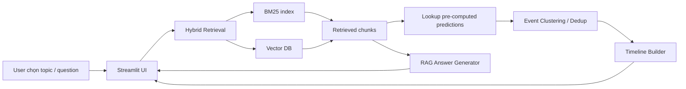
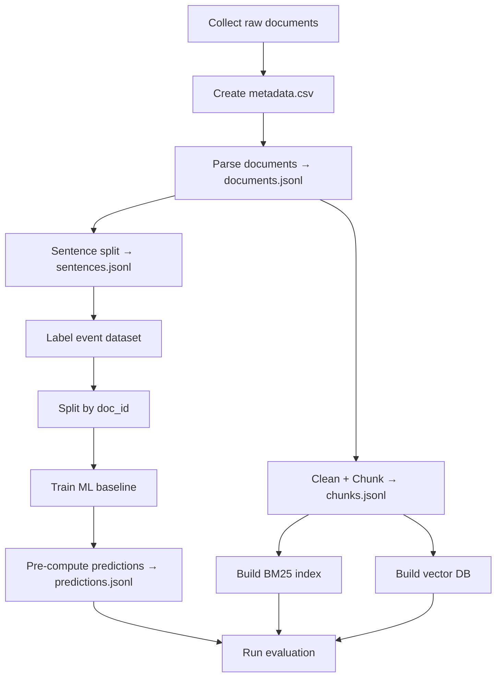
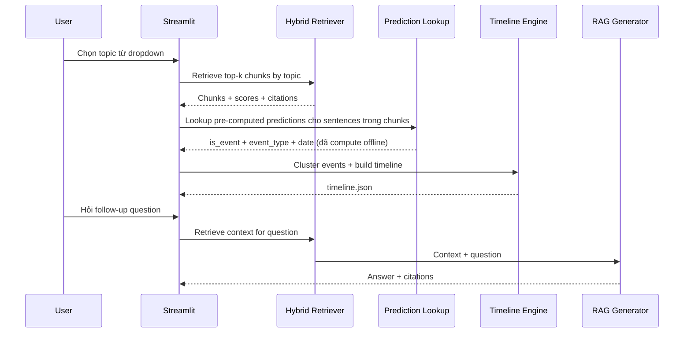

# ChronoRAG — ML-enhanced Timeline-Aware Research Assistant

> Plan v2.0 — Đã cập nhật theo Senior Engineer Review (2026-05-20)

Tài liệu này là kế hoạch triển khai tổng thể cho project AI/NLP đủ làm bài tập lớn môn Cơ sở Trí tuệ Nhân tạo. Project có ML/DL thật, có RAG, có evaluation, có report, và đủ nền tảng để demo local hoàn chỉnh.

---

## 1. Tóm tắt project

ChronoRAG là hệ thống Research Assistant cho các chủ đề AI/ML/NLP/Tech. Người dùng chọn topic, hệ thống truy xuất tài liệu liên quan từ corpus đã chuẩn bị, phát hiện câu mô tả sự kiện bằng ML classifier đã train, trích xuất mốc thời gian, gom trùng sự kiện bằng embedding clustering, rồi dựng timeline có citation.

Khác với chatbot PDF đơn giản, ChronoRAG kết hợp:
- **Hybrid Retrieval** (BM25 + Vector Search)
- **Event Sentence Classification** (TF-IDF + SVM/LogReg, optional BiLSTM)
- **Event Type Classification** (TF-IDF + SVM multiclass)
- **Date Extraction** (regex + document year fallback)
- **Event Deduplication** (sentence embedding + cosine similarity + threshold clustering)
- **Timeline Builder** (sorted events + citations)
- **RAG Chatbot** (LLM API + template fallback)

MVP dùng corpus cố định **3 topic** (mở rộng 5 nếu kịp), mỗi topic 10-15 tài liệu, có dataset tự gán nhãn **800+ câu** để train baseline ML. Demo chạy bằng Streamlit với các tab: topic input, event detection, timeline, chatbot và evaluation.

**Điểm mấu chốt**: Demo phải bắt đầu từ **tab Event Detection** (show ML predictions) → **tab Timeline** (show clustering) → **tab Evaluation** (show metrics) → rồi mới demo **Chatbot**. Chatbot là cherry on top, không phải main dish.

---

## 2. MVP scope và optional scope

### 2.1 MVP bắt buộc (3 tuần)

| Nhóm tính năng | Scope MVP | Output mong muốn |
|---|---|---|
| Corpus | **3 topic**, mỗi topic 10-15 documents (30-45 tổng) | `documents.jsonl` có metadata đầy đủ |
| Parsing | PDF, txt, md, html cơ bản | Text sạch theo document |
| Preprocessing | Chunking và sentence splitting | `chunks.jsonl`, `sentences.jsonl` |
| Retrieval | BM25 + FAISS/Chroma (merge đơn giản) | Top-k chunks theo topic/question |
| Event detection | TF-IDF + Logistic Regression/SVM baseline | `is_event`, probability |
| Event type | TF-IDF + SVM multiclass | **5 class**: `method_proposed`, `release`, `benchmark`, `trend_application`, `none` |
| Pre-computation | Event + type + date predictions offline cho tất cả sentences | `predictions.jsonl` |
| Date extraction | Regex + document year fallback | normalized year/date |
| Deduplication | Sentence embedding + cosine similarity + threshold + year constraint | event clusters |
| Timeline | Group theo năm, representative event, source citation | `timeline.json` |
| RAG chatbot | Retrieve context, answer bằng LLM API hoặc **template fallback** | answer + citations |
| UI | Streamlit 5 tab | Demo end-to-end |
| Evaluation | Classifier + retrieval metrics | `metrics.json`, confusion matrix, plots |
| Docs | README, architecture, data guide, demo script | Tài liệu bảo vệ |
| Sample data | 2-3 file mẫu + sample metadata + sample labels | Repo chạy được khi clone |

### 2.2 Should-have (tuần 4, nếu có 4-5 tuần)

| Upgrade | Giá trị |
|---|---|
| BiLSTM PyTorch | DL model thật, so sánh ML vs DL |
| SentenceTransformer + LogReg (Transfer Learning) | DL-based feature extraction, implement nhanh |
| Thêm 2 topic (tổng 5) | Mở rộng corpus |
| Thêm 400 labeled sentences (tổng 1200) | Cải thiện model |
| Hybrid retrieval tốt hơn (weighted merge) | Cải thiện retrieval |
| Gold timeline + timeline evaluation metrics | Evaluation chặt hơn |
| Experiment comparison table (ML vs DL) | Thêm chất cho report |

### 2.3 Could-have (tuần 5, nếu có)

| Upgrade | Giá trị |
|---|---|
| BERT fine-tuning | Model cao cấp nhất |
| Cross-encoder reranker | Tăng precision retrieval |
| HAC clustering + dendrogram | Visualization đẹp |
| Graph view | Quan hệ event-paper-method |
| Compare timeline 2 topic | UI nâng cao |
| Conversation history trong chatbot | UX tốt hơn |

### 2.4 Won't-have for now

| Không làm | Lý do |
|---|---|
| Crawl web tự động quy mô lớn | Tốn thời gian, khó kiểm soát chất lượng |
| Research brief generator riêng | Chatbot đã cover chức năng tương tự |
| Full agent workflow | Không cần để chứng minh AI core |
| Multi-user production backend | Streamlit local đủ cho demo |
| FastAPI + React | Không cần cho bài tập lớn |
| Evaluation bằng human study lớn | Dùng test set gán nhãn và metrics định lượng là đủ |

---

## 3. Kiến trúc tổng thể

### 3.1 High-level architecture



### 3.2 Offline và online separation

| Lớp | Chạy khi nào | Mục tiêu |
|---|---|---|
| **Offline preparation** | Trước demo, khi update data/model/index | Parse data, preprocess, label, train model, **pre-compute predictions**, build vector DB, evaluate |
| **Online demo** | Khi user mở Streamlit | Topic retrieval, **lookup pre-computed events**, cluster + timeline, RAG Q&A |

**Thay đổi quan trọng so với v1**: Event detection, type classification, và date extraction giờ chạy **offline** (pre-compute cho tất cả sentences). Online chỉ cần retrieve → lookup predictions → cluster → timeline. Điều này giúp demo nhanh hơn **5-10x**.

### 3.3 Thành phần chính

| Component | Trách nhiệm | Artifact |
|---|---|---|
| Data ingestion | Đọc raw PDF/txt/md/html và metadata | `documents.jsonl` |
| Preprocessing | Clean text, chunk, sentence split | `chunks.jsonl`, `sentences.jsonl` |
| Indexing | Build BM25 và vector DB | `bm25.pkl`, `faiss.index` hoặc Chroma folder |
| ML/DL models | Train và predict event sentence/type | `.pkl`, `.pt` |
| **Pre-computation** | **Predict offline tất cả sentences** | **`predictions.jsonl`** |
| Timeline engine | Extract date, cluster, group, rank event | `timeline.json` |
| Generation | RAG answer + **template fallback** | answer text + citations |
| Evaluation | Metrics và plots | `metrics.json`, `.png` |
| Streamlit app | Demo UI | interactive local app |

### 3.4 Nguyên tắc thiết kế

1. Tất cả dữ liệu trung gian lưu dạng JSONL/CSV để dễ inspect.
2. Model và index build bằng script riêng, không build trực tiếp trong Streamlit.
3. Mọi output quan trọng có `doc_id`, `chunk_id`, `sentence_id` để trace citation.
4. Không hard-code API key; dùng `.env` và `.env.example`.
5. **Bắt buộc có fallback không cần LLM API**: template answer dựa trên retrieved context.
6. **Bắt buộc có cached demo outputs**: `data/demo_outputs/` cho backup khi live demo lỗi.
7. MVP ưu tiên chạy ổn, giải thích được, có metrics hơn là mô hình quá lớn.
8. **TF-IDF chỉ fit trên train set**, transform trên val/test — tránh data leakage.

---

## 4. Repo structure

```text
chrono-rag-assistant/
├── app/
│   └── streamlit_app.py          # UI chỉ gọi service functions từ src/
│
├── workflows/
│   └── offline_pipeline.py       # Gom các bước offline thành 1 flow
│
├── configs/
│   ├── config.yaml               # Paths, hyperparams, thresholds
│   └── pipeline.yaml             # Thứ tự bước pipeline
│
├── scripts/
│   ├── 01_ingest_documents.py
│   ├── 02_preprocess_documents.py
│   ├── 03_export_labeling_data.py
│   ├── 04_train_ml_classifier.py
│   ├── 05_train_dl_classifier.py  # Optional: BiLSTM / Transfer Learning
│   ├── 06_build_vector_index.py
│   ├── 07_precompute_predictions.py  # NEW: offline prediction cho tất cả sentences
│   ├── 08_build_timeline.py
│   └── 09_evaluate_system.py
│
├── src/
│   ├── __init__.py
│   ├── ingest/
│   │   ├── __init__.py
│   │   ├── document_loader.py
│   │   ├── pdf_parser.py
│   │   └── html_parser.py
│   ├── preprocessing/
│   │   ├── __init__.py
│   │   ├── cleaner.py
│   │   ├── chunker.py
│   │   └── sentence_splitter.py
│   ├── indexing/
│   │   ├── __init__.py
│   │   ├── build_vector_index.py
│   │   └── build_bm25.py
│   ├── retrieval/
│   │   ├── __init__.py
│   │   ├── hybrid_retriever.py
│   │   ├── bm25_retriever.py
│   │   └── vector_retriever.py
│   ├── models/
│   │   ├── __init__.py
│   │   ├── train_event_baseline.py
│   │   ├── train_event_type.py
│   │   ├── predict_events.py
│   │   ├── bilstm.py              # Optional
│   │   └── train_event_bilstm.py  # Optional
│   ├── timeline/
│   │   ├── __init__.py
│   │   ├── date_extractor.py
│   │   ├── deduplicate.py
│   │   └── timeline_builder.py
│   ├── generation/
│   │   ├── __init__.py
│   │   ├── llm_client.py
│   │   ├── rag_answer.py
│   │   └── template_fallback.py   # NEW: fallback khi không có API key
│   ├── evaluation/
│   │   ├── __init__.py
│   │   ├── eval_classifier.py
│   │   ├── eval_retrieval.py
│   │   └── eval_timeline.py
│   └── utils/
│       ├── __init__.py
│       ├── config.py
│       ├── io.py
│       └── logger.py
│
├── data/
│   ├── raw/                       # Tài liệu gốc + metadata.csv
│   ├── processed/                 # documents.jsonl, chunks.jsonl, sentences.jsonl, predictions.jsonl
│   ├── labeled/                   # event_sentences.csv, splits/
│   ├── vector_db/                 # faiss.index, bm25.pkl
│   ├── eval/                      # Gold timelines, retrieval qrels
│   ├── demo_outputs/              # NEW: cached timeline/answer cho backup demo
│   └── sample/                    # NEW: 2-3 file mẫu để reviewer test nhanh
│
├── saved_models/                  # RENAMED: tránh confuse với src/models/
│   ├── event_baseline.pkl
│   ├── type_baseline.pkl
│   └── event_bilstm.pt           # Optional
│
├── reports/
│   └── figures/
├── docs/
│   ├── ARCHITECTURE.md
│   ├── DATA_GUIDE.md
│   ├── LABELING_GUIDE.md
│   ├── REPORT_OUTLINE.md
│   └── DEMO_SCRIPT.md
├── notebooks/                     # EDA, experiment nhanh
├── tests/
├── Makefile                       # NEW: gom commands
├── requirements.txt
├── .env.example
├── .gitignore
└── README.md
```

### 4.1 Giải thích thay đổi so với v1

| Thay đổi | Lý do |
|---|---|
| Thêm `__init__.py` cho tất cả packages | Để import hoạt động đúng |
| `models/` → `saved_models/` | Tránh confuse với `src/models/` |
| Thêm `data/demo_outputs/` | Backup khi live demo lỗi |
| Thêm `data/sample/` | Reviewer clone repo → chạy thử được ngay |
| Thêm `Makefile` | Gom pipeline commands |
| Thêm `src/generation/template_fallback.py` | Fallback bắt buộc khi không có API key |
| Thêm `scripts/07_precompute_predictions.py` | Pre-compute event/type/date offline |
| Bỏ `workflows/online_pipeline.py` | Streamlit gọi service functions trực tiếp, không cần orchestrator riêng |

### 4.2 Layer architecture

| Layer | Folder | Quy tắc |
|---|---|---|
| UI/frontend demo | `app/` | Chỉ hiển thị UI và gọi service functions từ `src/`. **Không import sklearn, torch, faiss** |
| Pipeline orchestration | `workflows/` | Gom nhiều bước offline thành flow hoàn chỉnh |
| CLI execution | `scripts/` | Chạy từng bước độc lập bằng command line |
| Backend/core logic | `src/` | Chứa logic thật. Tất cả ML/RAG/NLP code ở đây |

### 4.3 Makefile

```makefile
install:
	pip install -r requirements.txt

ingest:
	python scripts/01_ingest_documents.py

preprocess:
	python scripts/02_preprocess_documents.py

label-export:
	python scripts/03_export_labeling_data.py

train-ml:
	python scripts/04_train_ml_classifier.py

train-dl:
	python scripts/05_train_dl_classifier.py

build-index:
	python scripts/06_build_vector_index.py

precompute:
	python scripts/07_precompute_predictions.py

build-timeline:
	python scripts/08_build_timeline.py

evaluate:
	python scripts/09_evaluate_system.py

offline-all: ingest preprocess train-ml build-index precompute build-timeline evaluate

app:
	streamlit run app/streamlit_app.py

test:
	pytest tests/
```

---

## 5. Data schema chi tiết

### 5.1 Topics MVP

| # | Topic | Lý do chọn | Nguồn chính |
|---|---|---|---|
| 1 | **RAG** | Core topic, nhiều milestones rõ, dễ tìm paper | arXiv, LangChain docs, blogs |
| 2 | **Transformer** | Foundational, timeline dài (2017→nay), nhiều events | arXiv, Wikipedia, blogs |
| 3 | **AI Agent** | Trending, nhiều tool/framework releases gần đây | arXiv, GitHub, blogs |
| 4 | Knowledge Distillation | Optional tuần 4 |  |
| 5 | GraphRAG | Optional tuần 4 |  |

### 5.2 Corpus sources ưu tiên

| Source type | % corpus | Ưu điểm | Lưu ý |
|---|---|---|---|
| arXiv papers (abstract + intro) | **60-70%** | Có date rõ, có events, dễ parse abstract | Ưu tiên abstract + intro, đừng parse full PDF |
| Tech blogs (uy tín) | **15-20%** | Có application/trend | Chọn 3-5 blog nguồn cố định |
| GitHub README + release notes | **10-15%** | Tool/framework release dates | Chỉ lấy README có changelog rõ |
| Wikipedia (History section only) | **5-10%** | Overview tốt | Chỉ lấy History section |

### 5.3 `data/raw/metadata.csv`

| Column | Type | Bắt buộc | Mô tả |
|---|---|---:|---|
| `doc_id` | string | yes | ID duy nhất, ví dụ `rag_001` |
| `title` | string | yes | Tên paper/doc/blog |
| `topic` | string | yes | `rag`, `transformer`, `ai_agent` |
| `source_type` | string | yes | `paper`, `docs`, `github`, `wiki`, `blog` |
| `source_url` | string | yes | URL gốc |
| `published_date` | string/null | no | `YYYY-MM-DD` nếu biết |
| `year` | int/null | no | Năm công bố |
| `authors` | string/null | no | Danh sách tác giả nếu có |
| `local_path` | string | yes | File local trong `data/raw/` |
| `retrieved_at` | string | yes | Ngày nhóm tải tài liệu |

### 5.4 `data/processed/documents.jsonl`

```json
{
  "doc_id": "rag_001",
  "title": "Retrieval-Augmented Generation for Knowledge-Intensive NLP Tasks",
  "topic": "rag",
  "source_type": "paper",
  "source_url": "https://...",
  "published_date": "2020-05-22",
  "year": 2020,
  "authors": ["Patrick Lewis", "..."],
  "local_path": "data/raw/rag/rag_001.pdf",
  "text": "full parsed text ...",
  "retrieved_at": "2026-05-20"
}
```

### 5.5 `data/processed/chunks.jsonl`

```json
{
  "chunk_id": "rag_001_c0005",
  "doc_id": "rag_001",
  "topic": "rag",
  "title": "Retrieval-Augmented Generation for Knowledge-Intensive NLP Tasks",
  "chunk_index": 5,
  "text": "chunk text ...",
  "start_char": 3200,
  "end_char": 4100,
  "source_url": "https://...",
  "year": 2020
}
```

Chunking config:
- Chunk size: 300-500 words hoặc 800-1200 characters.
- Chunk overlap: 50-100 words.
- Mỗi chunk giữ metadata để citation không bị mất.

### 5.6 `data/processed/sentences.jsonl`

```json
{
  "sentence_id": "rag_001_s0032",
  "doc_id": "rag_001",
  "chunk_id": "rag_001_c0005",
  "topic": "rag",
  "sentence_index": 32,
  "text": "RAG was introduced in 2020 as a retrieval-augmented generation framework.",
  "source_url": "https://...",
  "year": 2020
}
```

### 5.7 `data/processed/predictions.jsonl` (NEW — pre-computed offline)

```json
{
  "sentence_id": "rag_001_s0032",
  "doc_id": "rag_001",
  "chunk_id": "rag_001_c0005",
  "topic": "rag",
  "text": "RAG was introduced in 2020 as a retrieval-augmented generation framework.",
  "is_event": 1,
  "event_prob": 0.92,
  "event_type": "method_proposed",
  "type_confidence": 0.85,
  "date_text": "2020",
  "normalized_date": "2020",
  "extracted_year": 2020,
  "date_confidence": 0.9,
  "date_source": "sentence_regex",
  "source_url": "https://...",
  "source_year": 2020
}
```

Tất cả predictions được tính offline bằng `scripts/07_precompute_predictions.py`. Online chỉ cần lookup file này theo `chunk_id` hoặc `sentence_id`.

### 5.8 Labeled dataset

File chính: `data/labeled/event_sentences.csv`

| Column | Type | Mô tả |
|---|---|---|
| `sentence_id` | string | ID từ `sentences.jsonl` |
| `sentence` | string | Nội dung câu |
| `is_event` | int | `1` nếu là event sentence, `0` nếu không |
| `event_type` | string | Một trong **5 label** |
| `doc_id` | string | Document gốc |
| `topic` | string | Topic |
| `source_year` | int/null | Năm document |
| `annotator` | string | Người gán nhãn |
| `label_note` | string/null | Ghi chú nếu câu khó |

MVP target:
- Tối thiểu **800 câu** gán nhãn (3 tuần), **1200 câu** nếu 5 tuần.
- Nên có **200-300 câu event** thật để tránh lệch class quá nặng.
- Mỗi topic khoảng 200-300 câu.

### 5.9 Event types (đã gộp từ 7 → 5 class)

| Label | Gộp từ v1 | Khi nào dùng | Ví dụ |
|---|---|---|---|
| `method_proposed` | giữ nguyên | Phương pháp, kiến trúc, thuật toán mới | "RAG was introduced in 2020..." |
| `release` | `model_release` + `tool_framework` | Model hoặc tool/framework được phát hành | "BERT was released in 2018...", "LangChain was launched in 2022..." |
| `benchmark` | `benchmark_result` | Kết quả benchmark, SOTA, performance | "The model achieved state-of-the-art results..." |
| `trend_application` | `survey_trend` + `application` | Xu hướng, survey, ứng dụng trong domain | "GraphRAG gained popularity in 2024...", "RAG applied to biomedical QA..." |
| `none` | giữ nguyên | Không phải event sentence | "RAG combines retrieval and generation." |

**Lý do gộp**: Với 800 câu, ~250 câu event → mỗi class trung bình ~60 mẫu. 7 class → chỉ 35 mẫu/class, quá ít. 5 class → ~60 mẫu/class, khả thi hơn.

### 5.10 Labeling guideline

Một câu được gán `is_event = 1` nếu thỏa ít nhất 2 trong 3 tiêu chí:

1. Có **hành động hoặc thay đổi đáng kể**: introduced, proposed, released, achieved, launched, adopted, applied, reported.
2. Có **mốc thời gian** rõ hoặc suy được từ context/source: năm, tháng, ngày, version, paper year.
3. Có **thực thể cụ thể**: model, method, paper, framework, benchmark, application.

Gán `is_event = 0` nếu câu chỉ định nghĩa khái niệm, mô tả cơ chế chung, liệt kê thành phần, hoặc không có sự kiện cụ thể.

Quy tắc khi câu khó:
- Nếu không có date trong câu nhưng document/paper year đủ rõ → vẫn có thể là event.
- "RAG combines retrieval and generation" → **không phải event** (mô tả chung).
- "In 2020, Lewis et al. proposed RAG" → **là event**.
- Nếu một câu chứa nhiều event, MVP giữ một event chính.

**Quy trình label**:
1. Viết guideline + **20 ví dụ mẫu** (10 event, 10 non-event) trước khi bắt đầu.
2. **Batch pilot 50 câu**: 2-3 người label cùng, so disagreement, thống nhất.
3. Tính **Cohen's Kappa** trên 50-100 câu overlap nếu >1 người label.
4. Liệt kê **5-10 edge cases** + quyết định cuối cùng vào guideline.
5. Có thể dùng **LLM pre-label** + human review để tăng tốc (nhưng phải ghi rõ trong report).

### 5.11 Split train/val/test

**Split theo `doc_id`, KHÔNG split random theo sentence.**

| Split | Tỷ lệ | Mục đích |
|---|---:|---|
| Train | 70% docs | Train model |
| Validation | 15% docs | Chọn hyperparameter |
| Test | 15% docs | Báo cáo kết quả cuối |

Cụ thể cho 3 topic, mỗi topic ~15 docs (45 docs tổng):
- Train: ~31 docs (~10-11 per topic)
- Val: ~7 docs (~2-3 per topic)
- Test: ~7 docs (~2-3 per topic)

Nguyên tắc:
- **Stratify by topic** — mỗi topic có mặt trong cả train/val/test.
- **Seed cố định** lưu trong `configs/config.yaml`.
- **Không dùng test set** để chỉnh threshold.
- Lưu file split cố định: `data/labeled/splits/train.csv`, `val.csv`, `test.csv`.

**⚠️ Data leakage prevention**:
- `TfidfVectorizer` chỉ **fit trên train set**, transform trên val/test.
- Không fit bất kỳ feature extractor nào trên toàn bộ dataset rồi mới split.

---

## 6. Module-by-module design

### 6.1 Module 1: Data Ingestion

| Mục | Thiết kế |
|---|---|
| Input | PDF, txt, md, html, `metadata.csv` |
| Output | `data/processed/documents.jsonl` |
| Main files | `src/ingest/document_loader.py`, `pdf_parser.py`, `html_parser.py` |
| Core logic | Đọc metadata, parse từng file, normalize whitespace, giữ source metadata |
| Error handling | Nếu parse lỗi, log vào `data/processed/ingest_errors.csv`, **không dừng pipeline** |
| Test | Parse thử 3 loại file, check `doc_id`, `text`, `source_url` không rỗng |

Ưu tiên parse:
1. **arXiv abstract + intro** — dễ nhất, text sạch
2. **Markdown/txt** — parse trực tiếp
3. **HTML** — BeautifulSoup strip tags
4. **PDF** — PyMuPDF/pdfplumber, fallback skip nếu lỗi nặng

### 6.2 Module 2: Preprocessing

| Mục | Thiết kế |
|---|---|
| Input | `documents.jsonl` |
| Output | `chunks.jsonl`, `sentences.jsonl` |
| Main files | `src/preprocessing/cleaner.py`, `chunker.py`, `sentence_splitter.py` |
| Core logic | Clean text, bỏ header/footer lặp, chunk, sentence split |
| Config | chunk_size, overlap, min_sentence_length |
| Test | Không chunk rỗng; mỗi sentence map được về `doc_id` và `chunk_id` |

Khuyến nghị:
- Sentence splitting: `nltk.sent_tokenize` hoặc spaCy.
- Markdown: loại code block dài.
- Giữ title/source ở metadata, không nhét vào text.

### 6.3 Module 3: Indexing

| Mục | Thiết kế |
|---|---|
| Input | `chunks.jsonl` |
| Output | Vector index, BM25 index, chunk metadata store |
| Main files | `src/indexing/build_vector_index.py`, `build_bm25.py` |
| Embedding | `all-MiniLM-L6-v2` (nhỏ, nhanh, đủ tốt cho tiếng Anh) |
| Vector DB | **FAISS** (đơn giản local) hoặc **Chroma** (metadata filtering tiện). Chọn một. |
| BM25 | `rank-bm25` trên tokenized chunks (whitespace + lowercase) |
| Test | 5 query mẫu trả về top-k chunks đúng topic |

Output:
- `data/vector_db/faiss.index`
- `data/vector_db/chunk_metadata.jsonl`
- `data/vector_db/bm25.pkl`
- `data/vector_db/bm25_corpus.pkl`

### 6.4 Module 4: Retrieval

| Mục | Thiết kế |
|---|---|
| Input | User query/topic |
| Output | Top-k chunks + scores + metadata |
| Main files | `src/retrieval/hybrid_retriever.py`, `bm25_retriever.py`, `vector_retriever.py` |
| MVP hybrid | Lấy top-k từ BM25 + top-k từ FAISS → merge + deduplicate by `chunk_id` |
| Topic filter | Pre-filter chunks by `topic` field trước retrieve (tránh cross-topic noise) |
| Test | 10 query mẫu có relevant result trong top-5/top-10 |

```python
# Pseudo-code hybrid đơn giản (MVP)
bm25_results = bm25_retrieve(query, top_k=10)
vector_results = vector_retrieve(query, top_k=10)
merged = deduplicate_by_chunk_id(bm25_results + vector_results)
final = merged[:top_k]
```

**Không cần** weighted scoring hay reciprocal rank fusion cho MVP.

### 6.5 Module 5: Event Sentence Classifier

| Mục | Thiết kế |
|---|---|
| Input | `data/labeled/splits/*.csv` |
| Output | trained baseline `.pkl`, prediction probabilities |
| Main files | `src/models/train_event_baseline.py`, `predict_events.py` |
| Baseline | TF-IDF + Logistic Regression **và** Linear SVM. Chọn cái F1 cao hơn. |
| **⚠️ TF-IDF** | **Fit trên train set only**, transform trên val/test |
| Features | TF-IDF unigram + bigram, max_features=5000-10000 |
| Metrics | Accuracy, Precision, Recall, **F1 (event class)**, Confusion Matrix |
| Test | Inference 5 câu mẫu, output probability trong `[0,1]` |

Optional DL models (tuần 4-5):
| Model | Implement | Ưu tiên |
|---|---|---|
| **SentenceTransformer + LogReg** | Encode sentences → train LogReg trên embeddings. 30 phút implement. | **Ưu tiên 1** — Transfer Learning baseline, dễ làm |
| **BiLSTM PyTorch** | Build vocab, embedding layer, 2-layer BiLSTM, linear head. 2-4 ngày. | **Ưu tiên 2** — DL model thật |

### 6.6 Module 6: Event Type Classifier

| Mục | Thiết kế |
|---|---|
| Input | Event sentences có label type |
| Output | `event_type`, confidence |
| Main files | `src/models/train_event_type.py` |
| Baseline | TF-IDF + Linear SVM multiclass (5 class) |
| Metrics | **Macro-F1**, per-class Precision/Recall/F1, confusion matrix |
| Class weight | `class_weight='balanced'` để xử lý class imbalance |

Pipeline design:
- Chạy event detector trước → chỉ classify type cho câu event (`is_event=1`).
- Train type classifier trên tất cả labeled events + `none` class.

### 6.7 Module 7: Date Extraction

| Mục | Thiết kế |
|---|---|
| Input | Event sentence + document metadata |
| Output | `date_text`, `normalized_date`, `extracted_year`, `date_confidence`, `date_source` |
| Main files | `src/timeline/date_extractor.py` |
| Method | Regex cho year/date/month |
| Fallback | Nếu câu không có date → dùng `document.year` với confidence thấp |
| Test | Unit tests cho `2020`, `May 2020`, `2020-05-22`, `in 2024` |

Regex patterns:

```python
patterns = [
    r'\b(19|20)\d{2}\b',                           # 2020
    r'(January|February|March|April|May|June|July|August|September|October|November|December)\s+\d{4}',  # May 2020
    r'\d{4}-\d{2}(-\d{2})?',                        # 2020-05-22 or 2020-05
    r'(in|around|circa|since|after|before)\s+(19|20)\d{2}',  # in 2020
]
```

### 6.8 Module 8: Event Clustering / Deduplication

| Mục | Thiết kế |
|---|---|
| Input | Event sentences + embeddings + dates + sources |
| Output | `event_clusters.jsonl` |
| Main files | `src/timeline/deduplicate.py` |
| Embedding | SentenceTransformer (cùng model dùng cho retrieval) |
| Similarity | Cosine similarity |
| Clustering | **Threshold-based** cho MVP |
| **Year constraint** | Chỉ gom nếu `abs(year_a - year_b) <= 1` |
| Test | Các câu paraphrase cùng event được gom chung |

MVP threshold:

```python
# Pseudo-code
if cosine_similarity(sent_a, sent_b) >= 0.78 and abs(year_a - year_b) <= 1:
    same_cluster
elif cosine_similarity(sent_a, sent_b) >= 0.70 and same_doc_or_topic:
    same_cluster  # conservative merge
else:
    separate_clusters
```

Representative event selection (thứ tự ưu tiên):
1. Câu có **event probability cao nhất** trong cluster.
2. Câu có **date rõ nhất** (sentence_regex > document_year).
3. Câu từ **source uy tín hơn** (paper > docs > blog > wiki).
4. Câu **ngắn hơn, rõ nghĩa hơn**.

### 6.9 Module 9: Timeline Builder

| Mục | Thiết kế |
|---|---|
| Input | Event clusters + dates + sources |
| Output | `timeline.json` |
| Main files | `src/timeline/timeline_builder.py` |
| Core logic | Sort theo date, group theo year, rank event, attach citations |
| UI output | Timeline table/card, filter theo event type |
| Test | Timeline sorted đúng, mỗi event có source |

Timeline schema:

```json
{
  "topic": "rag",
  "generated_at": "2026-05-20T12:00:00",
  "total_events": 12,
  "events": [
    {
      "event_id": "rag_evt_0001",
      "date": "2020",
      "year": 2020,
      "event_type": "method_proposed",
      "title": "RAG was introduced for knowledge-intensive NLP tasks",
      "representative_sentence": "RAG was introduced in 2020...",
      "confidence": 0.86,
      "sources": [
        {
          "doc_id": "rag_001",
          "title": "Retrieval-Augmented Generation for...",
          "source_url": "https://...",
          "chunk_id": "rag_001_c0005"
        }
      ],
      "cluster_size": 3
    }
  ]
}
```

### 6.10 Module 10: RAG Answer Generator

| Mục | Thiết kế |
|---|---|
| Input | User question + retrieved chunks |
| Output | answer + citations |
| Main files | `src/generation/llm_client.py`, `rag_answer.py`, `template_fallback.py` |
| LLM | OpenAI/Gemini/OpenRouter qua `.env` |
| **Fallback** | **Template answer khi không có API key — BẮT BUỘC** |
| Citation | `[doc_id]` hoặc title + URL |
| Test | 5 câu hỏi demo trả lời có citation; fallback chạy khi không có API key |

Template fallback design:

```python
def template_answer(question, retrieved_chunks, top_n=3):
    """Fallback khi không có LLM API key."""
    relevant = retrieved_chunks[:top_n]
    answer = f"Based on {len(relevant)} retrieved documents:\n\n"
    for i, chunk in enumerate(relevant, 1):
        answer += f"{i}. {chunk['text'][:200]}... "
        answer += f"[Source: {chunk['title']}]({chunk['source_url']})\n\n"
    return answer
```

UI hiển thị warning: "⚠️ LLM API chưa cấu hình, đang dùng template fallback."

### 6.11 Module 11: Evaluation

| Mục | Thiết kế |
|---|---|
| Input | predictions, labels, retrieval results, gold timeline |
| Output | `metrics.json`, confusion matrix, plots |
| Main files | `src/evaluation/eval_classifier.py`, `eval_retrieval.py`, `eval_timeline.py` |

**Classifier metrics**:
| Metric | Dùng cho | Ghi chú |
|---|---|---|
| **F1 (event class)** | Event detection | Metric chính, xử lý class imbalance |
| Accuracy | Event detection | Tham khảo, không dùng làm chính |
| Precision, Recall | Event detection | Hiểu trade-off |
| **Macro-F1** | Event type | Công bằng giữa class |
| Per-class F1 | Event type | Xem class nào yếu |
| Confusion Matrix | Cả hai | Visualize lỗi |

**Retrieval metrics**:
| Metric | Cách tính |
|---|---|
| **Recall@5, Recall@10** | Gold doc/chunk có trong top-k không |
| MRR | Vị trí trung bình của gold result đầu tiên |

**Timeline metrics** (đơn giản):
| Metric | Cách tính |
|---|---|
| **Date Accuracy** | Trong events tìm được, bao nhiêu % có year đúng so với gold |
| **Event Coverage** | Bao nhiêu % gold events được hệ thống tìm thấy |
| Duplicate Reduction Rate | `1 - num_output_events / num_input_event_sentences` |

Timeline evaluation đơn giản:
1. Tạo **gold timeline thủ công cho 1-2 topic** (10-15 events mỗi topic, mỗi event có year + mô tả ngắn). Mất ~30 phút/topic.
2. So sánh system output với gold.
3. **Không cần** Citation Accuracy metric phức tạp — kiểm tra thủ công 10-20 events là đủ.

**MVP success metrics**:
| Metric | Ngưỡng hợp lý |
|---|---:|
| Event detection F1 | >= 0.70 |
| Event type Macro-F1 | >= 0.50-0.60 |
| Retrieval Recall@5 | >= 0.70 |
| Timeline Date Accuracy | >= 0.75 |
| Duplicate Reduction Rate | 20%-50% |

Nếu metric thấp hơn ngưỡng, vẫn bảo vệ được nếu có **error analysis rõ**: data ít, label nhiễu, date trong source không rõ, hoặc event paraphrase khó.

### 6.12 Module 12: Streamlit UI

| Tab | Nội dung | Output |
|---|---|---|
| Topic Input | Dropdown chọn topic (3 topic cố định), top-k, model mode | Start pipeline |
| Event Detection | Sentences, event probability, event type, date | Inspect ML predictions |
| Timeline | Timeline sorted theo thời gian, filter type | **Main demo view** |
| Chatbot | Q&A trên retrieved context | Answer + citations |
| Evaluation | Metrics, confusion matrix, retrieval scores | Bằng chứng định lượng |

UI nguyên tắc:
- Streamlit chỉ gọi service functions, **không chứa logic ML**.
- Dùng `@st.cache_resource` cho model/index loading.
- Có **sample topic dropdown** — không cho nhập topic tự do.
- Có nút "Run ChronoRAG" để demo rõ flow.
- Pre-load cached demo outputs cho topic RAG.

---

## 7. Thuật toán ML/DL và giải thích

| Thuật toán | Module | Dùng để | Giải thích được |
|---|---|---|---|
| TF-IDF | Event classifier, type classifier | Feature extraction: câu → vector sparse | Term frequency × inverse document frequency |
| Logistic Regression | Event classifier baseline | Binary classification event/non-event | Sigmoid, probability output, cross-entropy loss |
| Linear SVM | Event type classifier | Multiclass classification 5 class | Margin optimization, tốt với sparse features |
| Word Embedding | BiLSTM (optional) | Token → vector dense | Learned representation vs one-hot |
| BiLSTM | DL event classifier (optional) | Sequence learning, word order | Forward + backward context |
| Sentence Embedding | Retrieval + clustering | Sentence → vector dense | SentenceTransformer pre-trained |
| Cosine Similarity | Retrieval + dedup | Đo semantic similarity | Scale-invariant, angle-based |
| KNN / ANN | Vector DB (FAISS) | Top-k nearest chunks | Approximate nearest neighbor search |
| BM25 | Keyword retrieval | Exact term matching | Probabilistic retrieval, TF saturation |
| Threshold Clustering | Event dedup | Gom events trùng | Cosine >= threshold + year constraint |
| HAC | Optional clustering | Hierarchical clustering | Dendrogram visualization |
| Precision/Recall/F1 | Evaluation | Đo classifier quality | Standard metrics, handle class imbalance |
| Recall@k / MRR | Retrieval evaluation | Đo retrieval quality | Ranking evaluation |

---

## 8. Pipeline offline và online

### 8.1 Offline preparation



Step-by-step:

1. Thu thập raw documents cho 3 topic.
2. Tạo `metadata.csv` với source URL, topic, date/year.
3. Parse documents thành `documents.jsonl`.
4. Clean text, chunking, sentence splitting.
5. Lấy sample sentences để gán nhãn event/type.
6. Split train/val/test theo `doc_id` (stratified by topic).
7. Train TF-IDF + LogReg/SVM (fit TF-IDF **only on train**).
8. Build BM25 và vector DB từ chunks.
9. **Pre-compute predictions** cho tất cả sentences → `predictions.jsonl`.
10. Run evaluation và lưu metrics/plots.

### 8.2 Online demo



**Key difference vs v1**: Online KHÔNG chạy ML model inference. Chỉ lookup `predictions.jsonl`. Demo nhanh hơn rất nhiều.

---

## 9. Sprint plan (3 tuần core + 2 tuần optional)

### Sprint 1 (Tuần 1): Data Foundation

| Mục | Nội dung |
|---|---|
| **Goal** | Có raw data, parsed data, và labeled dataset sẵn sàng train |
| **Tasks** | |
| | Tạo repo skeleton + configs + Makefile |
| | Chọn 3 topic, thu thập 30-45 docs |
| | Implement parsers (PDF/txt/md) |
| | Chunking + sentence splitting |
| | Viết labeling guide + label 800+ câu |
| | Split train/val/test by doc_id |
| | Tạo sample data trong `data/sample/` |
| **Deliverables** | Repo structure, `metadata.csv`, `documents.jsonl`, `chunks.jsonl`, `sentences.jsonl`, `event_sentences.csv`, `train.csv`/`val.csv`/`test.csv` |
| **Done criteria** | ≥800 labeled rows, ≥200 event rows, splits không trùng doc_id, `pip install -r requirements.txt` chạy |
| **Risk** | Labeling mất thời gian |
| **Fallback** | Dùng LLM pre-label + human review; 600 câu đủ cho baseline |

### Sprint 2 (Tuần 2): ML + Retrieval + Timeline

| Mục | Nội dung |
|---|---|
| **Goal** | Có baseline model, retrieval index, và timeline pipeline hoạt động |
| **Tasks** | |
| | Train TF-IDF + LogReg/SVM (event detection) |
| | Train TF-IDF + SVM (event type, 5 class) |
| | Build BM25 index |
| | Build FAISS/Chroma index |
| | Implement date extraction (regex) |
| | Implement event clustering (threshold + year constraint) |
| | Build timeline cho 3 topic |
| | Pre-compute predictions offline → `predictions.jsonl` |
| **Deliverables** | `event_baseline.pkl`, `type_baseline.pkl`, `bm25.pkl`, `faiss.index`, `predictions.jsonl`, `timeline.json` × 3 topic |
| **Done criteria** | Event F1 ≥ 0.65, 5 query test trả đúng topic, timeline sorted + has citations |
| **Risk** | Model F1 thấp |
| **Fallback** | Kiểm tra label quality, thử class weighting, dùng SentenceTransformer embeddings + LogReg |

### Sprint 3 (Tuần 3): UI + Chatbot + Evaluation + Polish

| Mục | Nội dung |
|---|---|
| **Goal** | Demo end-to-end chạy được, có evaluation, có report |
| **Tasks** | |
| | Streamlit UI (5 tab) |
| | RAG chatbot + template fallback |
| | Evaluation pipeline (classifier + retrieval) |
| | Tạo gold timeline cho 1-2 topic |
| | Timeline evaluation (Date Accuracy, Coverage) |
| | Tạo cached demo outputs |
| | README + demo script + report outline |
| | Demo rehearsal |
| **Deliverables** | `streamlit_app.py`, `metrics.json`, confusion matrix plots, `README.md`, `DEMO_SCRIPT.md` |
| **Done criteria** | Demo chạy <20s sau load, 5 câu hỏi demo có citation, fallback hoạt động, clone → setup → run OK |
| **Risk** | UI chậm, API key lỗi |
| **Fallback** | Cached demo outputs, template fallback |

### Sprint 4 (Tuần 4, optional): DL Model + Mở rộng

| Mục | Nội dung |
|---|---|
| **Goal** | Có DL model, mở rộng corpus |
| **Tasks** | |
| | Implement SentenceTransformer + LogReg (Transfer Learning) |
| | Hoặc: Implement BiLSTM PyTorch |
| | Thêm 2 topic (tổng 5 topic) |
| | Label thêm 400 câu |
| | Experiment comparison table (ML vs DL vs Transfer) |
| | Hybrid retrieval cải tiến |
| **Deliverables** | `transfer_model.pkl` hoặc `event_bilstm.pt`, experiment table, data mới |
| **Done criteria** | DL model train được, comparison table có số liệu |
| **Risk** | BiLSTM kém baseline |
| **Fallback** | Trình bày comparison, giải thích dataset nhỏ → DL cần data lớn hơn |

### Sprint 5 (Tuần 5, optional): Polish + Advanced

| Mục | Nội dung |
|---|---|
| **Goal** | Nâng cấp chất lượng, hoàn thiện report |
| **Tasks** | |
| | BERT fine-tune hoặc cross-encoder reranker |
| | HAC clustering + dendrogram |
| | UI polish |
| | Final report + figures |
| | Demo rehearsal 2-3 lần |
| | Sample data + README hoàn chỉnh |
| **Deliverables** | Advanced model, `final_report.md`, polished UI |
| **Done criteria** | Report hoàn chỉnh, demo mượt 7-10 phút |

### Timeline tổng

| Tuần | Sprint | Mục tiêu cuối tuần |
|---|---|---|
| Tuần 1 | Sprint 1 | Có data sạch + 800 câu labeled |
| Tuần 2 | Sprint 2 | Có ML baseline + retrieval + timeline |
| Tuần 3 | Sprint 3 | Có Streamlit demo + chatbot + evaluation |
| Tuần 4 | Sprint 4 (optional) | Có DL model + 5 topic |
| Tuần 5 | Sprint 5 (optional) | Report + polish + advanced models |

---

## 10. Checklist deliverables

### 10.1 Repo và chạy local

- [ ] Repo có structure rõ ràng, có `__init__.py` cho tất cả packages.
- [ ] `README.md` có hướng dẫn setup, prepare data, train, build index, run app.
- [ ] `requirements.txt` đầy đủ.
- [ ] `.env.example` có biến: `OPENAI_API_KEY`, `GEMINI_API_KEY`, `LLM_PROVIDER`.
- [ ] `.gitignore` bỏ qua `.env`, saved models lớn, cache, `__pycache__`.
- [ ] `configs/config.yaml` chứa paths, hyperparameters, thresholds, seed.
- [ ] `Makefile` có targets: install, ingest, preprocess, train-ml, build-index, precompute, evaluate, app, test.
- [ ] `workflows/offline_pipeline.py` điều phối pipeline offline.
- [ ] `data/sample/` có 2-3 file mẫu để test nhanh.
- [ ] `data/demo_outputs/` có cached timeline/answer cho backup demo.

### 10.2 Data

- [ ] Có 30-45 docs trong `data/raw/` (3 topic × 10-15 docs).
- [ ] Có `metadata.csv` đầy đủ.
- [ ] Có `documents.jsonl`.
- [ ] Có `chunks.jsonl`.
- [ ] Có `sentences.jsonl`.
- [ ] Có 800+ labeled sentences.
- [ ] Có train/val/test split theo `doc_id`, stratified by topic.

### 10.3 Model và retrieval

- [ ] Có script train baseline (event + type).
- [ ] Có saved baseline models trong `saved_models/`.
- [ ] Có `predictions.jsonl` (pre-computed offline).
- [ ] Có BM25 index.
- [ ] Có FAISS/Chroma vector index.
- [ ] Có hybrid retriever (merge BM25 + FAISS).

### 10.4 Timeline và RAG

- [ ] Có date extractor với unit tests.
- [ ] Có event clustering/dedup (threshold + year constraint).
- [ ] Có timeline builder.
- [ ] Có RAG chatbot với citations.
- [ ] Có **template fallback** khi không có LLM API key.
- [ ] Có cached demo outputs cho backup.

### 10.5 Evaluation và demo

- [ ] Có classifier metrics (F1, confusion matrix).
- [ ] Có retrieval metrics (Recall@k).
- [ ] Có timeline metrics (Date Accuracy, Coverage) cho ít nhất 1 topic.
- [ ] Có Streamlit app 5 tab.
- [ ] Có demo script.
- [ ] Có report outline.

---

## 11. Risk list

| # | Risk | Impact | Probability | Mitigation | Fallback |
|---|---|---|---|---|---|
| R1 | Dataset label ít hoặc lệch class | 🔴 Cao | 🟡 Trung bình | Sampling có chủ đích câu chứa year/verbs; `class_weight='balanced'` | Giảm xuống 600 câu, report Macro-F1 |
| R2 | Label không nhất quán | 🔴 Cao | 🟡 Trung bình | Guideline rõ, pilot 50 câu, review disagreement | Tính Cohen's Kappa, giải thích trong report |
| R3 | PDF parse lỗi | 🟡 Trung bình | 🔴 Cao | Ưu tiên arXiv abstract + txt/md, PyMuPDF/pdfplumber fallback | Bỏ PDF lỗi, thay bằng txt/md |
| R4 | Model F1 thấp (<0.6) | 🔴 Cao | 🟡 Trung bình | Kiểm tra label quality, class weighting, feature engineering | Error analysis rõ, giải thích data khó |
| R5 | BiLSTM kém baseline | 🟡 Thấp | 🔴 Cao | Dự kiến từ đầu, đây là comparison hợp lệ | Trình bày "DL cần data lớn hơn" |
| R6 | Retrieval trả sai topic | 🟡 Trung bình | 🟡 Trung bình | Pre-filter by topic field, hybrid BM25+dense | Chỉ dùng BM25 with topic filter |
| R7 | Timeline sai mốc thời gian | 🟡 Trung bình | 🟡 Trung bình | Regex test cases, fallback document year, manual verify | Accept lower Date Accuracy, ghi limitations |
| R8 | Demo chạy chậm (>30s) | 🟡 Trung bình | 🟡 Trung bình | Pre-compute predictions offline, `@st.cache_resource` | Cached demo outputs |
| R9 | API lỗi hoặc hết quota | 🔴 Cao | 🟡 Trung bình | Template fallback, cached responses | Demo không dùng API |
| R10 | Scope quá rộng | 🔴 Cao | 🔴 Cao | Chốt 3 topic MVP, cắt BiLSTM/brief nếu cần | Demo baseline + BM25 + timeline cơ bản |

---

## 12. Demo flow

### 12.1 Kịch bản demo 7-10 phút

1. **Mở slide/README giới thiệu**: ChronoRAG không phải chatbot PDF, mà là RAG + event detection + timeline.
2. **Mở Streamlit app**.
3. **Chọn topic `RAG`** từ dropdown.
4. **Tab Event Detection** (SHOW ĐẦU TIÊN): cho thấy câu nào được ML model đánh dấu event, probability, type, date. **Đây là nơi chứng minh có AI thật.**
5. **Tab Timeline**: hiển thị timeline theo năm (2020 RAG introduced, 2022 LangChain, 2023 ChatGPT retrieval, 2024 GraphRAG...).
6. **Tab Evaluation**: show F1, confusion matrix, Recall@k. **Chứng minh đánh giá nghiêm túc.**
7. **Tab Chatbot**: hỏi "What are the key milestones in RAG research?" và cho thấy answer có citation.
8. **Kết luận**: nêu MVP, thuật toán, hạn chế, hướng mở rộng.

> **Thứ tự demo**: Event Detection → Timeline → Evaluation → Chatbot. KHÔNG demo chatbot trước.

### 12.2 Câu hỏi demo nên chuẩn bị sẵn

| Topic | Question |
|---|---|
| RAG | "What were the major milestones in RAG research?" |
| Transformer | "How did Transformer models evolve after 2017?" |
| AI Agent | "What tools or frameworks contributed to AI agents?" |

### 12.3 Backup plan khi demo lỗi

- Có `data/demo_outputs/` chứa timeline JSON đã chạy trước.
- Có screenshots trong `reports/figures/`.
- Có template fallback không gọi LLM API.
- Có sample topic dropdown — không phụ thuộc user nhập tự do.

---

## 13. Report outline

### 13.1 Outline

1. **Giới thiệu**: Bối cảnh RAG, nhu cầu timeline-aware research assistant, vì sao chatbot PDF chưa đủ.
2. **Mục tiêu project**: Input/output, MVP scope, contributions chính.
3. **Dataset**: Corpus sources, metadata schema, labeled dataset, labeling guideline, train/val/test split, chống data leakage.
4. **Phương pháp**:
   - Document parsing và preprocessing.
   - BM25 và dense retrieval.
   - TF-IDF + LogReg/SVM (event detection + type classification).
   - BiLSTM / Transfer Learning (optional).
   - Date extraction (regex + fallback).
   - Event clustering/deduplication (cosine + threshold + year constraint).
   - Timeline builder.
   - RAG answer generation + template fallback.
5. **System architecture**: Offline pipeline, online demo pipeline, repo/module design.
6. **Experiments and evaluation**:
   - Experiment table (ML vs DL nếu có).
   - Classifier metrics.
   - Retrieval metrics.
   - Timeline metrics.
   - Error analysis.
7. **Demo application**: Streamlit UI, example timeline, example Q&A with citations.
8. **Limitations**: Dataset nhỏ, rule-based date extraction, clustering threshold sensitivity, LLM hallucination risk.
9. **Future work**: BERT fine-tuning, reranker, graph view, auto-update corpus.
10. **Kết luận**: Tổng kết giá trị AI/NLP, bài học, khả năng mở rộng.

### 13.2 Figures nên có

- Architecture diagram.
- Offline/online pipeline diagram.
- Label distribution chart.
- Confusion matrix (event + type).
- Retrieval Recall@k chart.
- Timeline screenshot.
- Streamlit UI screenshot.
- Experiment comparison table (nếu có DL model).

---

## 14. Những câu thầy có thể hỏi

### Câu hỏi cốt lõi

| Câu hỏi | Ý chính nên trả lời |
|---|---|
| Project này khác chatbot PDF ở đâu? | Có event detection bằng ML classifier tự train, date extraction, event dedup bằng embedding clustering, và timeline builder — không chỉ retrieve-answer |
| AI nằm ở đâu? | 4 chỗ: (1) Event classification TF-IDF+SVM, (2) Event type multiclass SVM, (3) Dense retrieval KNN search, (4) Event clustering cosine similarity. Train model thật trên labeled dataset tự tạo |
| Vì sao dùng TF-IDF baseline? | Nhanh, mạnh với text classification nhỏ (<2000 samples), dễ giải thích, làm benchmark cho DL |
| Logistic Regression khác SVM thế nào? | LogReg cho probability output qua sigmoid; SVM tối ưu margin, thường tốt với sparse TF-IDF. Train cả hai, chọn F1 cao hơn |
| Vì sao cần BiLSTM? | Học thứ tự từ và context hai chiều mà TF-IDF (bag-of-words) không capture. Tuy nhiên dataset nhỏ → có thể không hơn baseline, đây cũng là kết quả hợp lệ |
| Nếu BiLSTM kém baseline thì sao? | Dataset nhỏ; TF-IDF sparse thường mạnh với text classification nhỏ; comparison vẫn hợp lệ và giải thích được |
| Làm sao tránh data leakage? | Split theo `doc_id` không theo sentence; TF-IDF fit only on train; seed cố định |
| BM25 và vector search khác nhau thế nào? | BM25: exact keyword matching, probabilistic; Dense: semantic similarity qua embeddings; Hybrid tận dụng cả hai |
| Citation lấy từ đâu? | Metadata `doc_id`, `chunk_id`, `source_url` giữ từ ingest tới generation, chain: doc→chunk→sentence→event→timeline |
| Date extraction có đáng tin không? | Regex cover ~80% cases domain AI/Tech; fallback document year có confidence thấp; đánh giá Date Accuracy |
| Dedup event hoạt động thế nào? | Embed sentences, cosine similarity ≥ 0.78 + year constraint (diff ≤ 1), chọn representative có probability cao nhất |
| Metrics chính là gì? | Event F1, Type Macro-F1, Retrieval Recall@k, Timeline Date Accuracy |
| Nếu LLM hallucinate thì sao? | Prompt grounded context only, citations bắt buộc, template fallback không dùng LLM, chỉ trả lời dựa trên retrieved chunks |
| Vì sao chọn Streamlit? | Nhanh demo AI pipeline, đủ tab visualize event/timeline/chat/eval, caching built-in |
| Vì sao không dùng LLM làm hết? | (1) Mục tiêu môn là chứng minh hiểu thuật toán ML/DL, (2) LLM hallucinate, (3) LLM đắt/chậm cho batch, (4) Train model riêng → control + evaluate từng module độc lập |
| Hạn chế lớn nhất? | Dataset nhỏ, rule-based date extraction, clustering threshold thủ công |

### Câu hỏi nâng cao

| Câu hỏi | Ý chính nên trả lời |
|---|---|
| Class imbalance xử lý thế nào? | `class_weight='balanced'` trong SVM/LogReg; report Macro-F1 thay vì Accuracy |
| BM25 hoạt động thế nào chi tiết? | Score = tổng IDF × TF saturation (TF/(TF+k1)) × length normalization. Khác TF-IDF: có saturation + length norm |
| FAISS hoạt động thế nào? | Lưu embeddings, query → cosine/L2 distance → top-k nearest. Có ANN (IVF, HNSW) cho search nhanh |
| Threshold clustering khác K-means? | K-means cần k trước, dùng centroid; Threshold không cần k, gom nếu similarity ≥ threshold. Phù hợp dedup vì không biết trước số events trùng |
| Cosine similarity tại sao không dùng Euclidean? | Cosine scale-invariant — đo góc giữa vectors, không bị ảnh hưởng bởi magnitude. Phù hợp cho embeddings đã normalized |

---

## 15. Thứ tự 10 việc đầu tiên cần làm ngay

| # | Việc | Thời gian |
|---|---|---|
| 1 | Chốt 3 topic MVP: `RAG`, `Transformer`, `AI Agent` | 15 phút |
| 2 | Tạo repo skeleton: folders, `__init__.py`, `requirements.txt`, `.gitignore`, `.env.example`, `Makefile` | 1 giờ |
| 3 | Tạo `configs/config.yaml` với paths, hyperparams, thresholds, seed | 30 phút |
| 4 | Thu thập 10-15 docs cho topic `RAG` (ưu tiên arXiv abstract/intro) | 2-3 giờ |
| 5 | Viết `LABELING_GUIDE.md` với 20 ví dụ mẫu | 1 giờ |
| 6 | Implement PDF/txt/md parser → `documents.jsonl` | 2-3 giờ |
| 7 | Implement chunking + sentence splitting → `chunks.jsonl`, `sentences.jsonl` | 2-3 giờ |
| 8 | Label pilot 100 câu (cả nhóm) → review disagreement → fix guideline | 2-3 giờ |
| 9 | Label 700+ câu còn lại (chia đều, LLM pre-label nếu cần) | 5-8 giờ |
| 10 | Train baseline TF-IDF + LogReg, report F1 → confirm pipeline hoạt động | 1-2 giờ |

---

## 16. Checklist trước khi bắt đầu implement

- [ ] Chốt danh sách 3 topic + lý do chọn.
- [ ] Chốt danh sách nguồn tài liệu cụ thể cho mỗi topic (URL).
- [ ] Thống nhất labeling guideline trong nhóm (pilot 50 câu).
- [ ] Chốt event type schema: **5 class** (`method_proposed`, `release`, `benchmark`, `trend_application`, `none`).
- [ ] Chốt tech stack: FAISS hay Chroma? PyMuPDF hay pdfplumber? SentenceTransformer model nào?
- [ ] Cài đặt môi trường: Python 3.10+, virtualenv, test import torch/faiss/sklearn.
- [ ] Tạo repo GitHub, set branch protection, commit initial skeleton.
- [ ] Phân công rõ ai làm gì tuần 1.
- [ ] Chốt LLM API plan: key nào, provider nào, budget bao nhiêu, template fallback sẵn sàng.
- [ ] Highlight 3 rủi ro lớn nhất (R1 label, R9 API, R10 scope), confirm có fallback.

---

## Phụ lục A: Config groups

| Config group | Tham số |
|---|---|
| `paths` | raw_data, processed_data, labeled_data, saved_models, vector_db |
| `preprocessing` | chunk_size, chunk_overlap, min_sentence_length |
| `retrieval` | top_k_bm25, top_k_vector, embedding_model |
| `models` | baseline_type, class_weight, tfidf_max_features, tfidf_ngram_range |
| `models_dl` | bilstm_hidden_size, bilstm_num_layers, batch_size, learning_rate, epochs |
| `timeline` | event_threshold, similarity_threshold, max_events_per_topic, year_diff_max |
| `llm` | provider, model_name, temperature, max_tokens |
| `evaluation` | seed, metrics_output_path |

## Phụ lục B: Citation chain

```
document (doc_id, source_url, title)
  → chunk (chunk_id, doc_id)
    → sentence (sentence_id, chunk_id, doc_id)
      → prediction (sentence_id, is_event, event_type, date)
        → event cluster (event_id, representative sentence_id, sources)
          → timeline entry (sources: [{doc_id, title, source_url}])
            → RAG answer citation: [Title](source_url)
```

Metadata `doc_id`, `chunk_id`, `source_url` phải được giữ xuyên suốt từ ingest đến generation. Nếu mất ở bất kỳ bước nào → citation sẽ không hoạt động.
